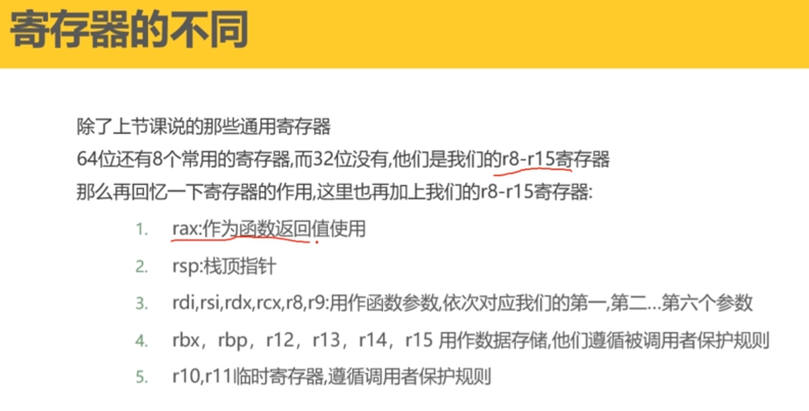
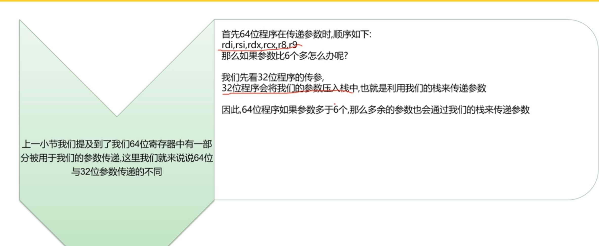
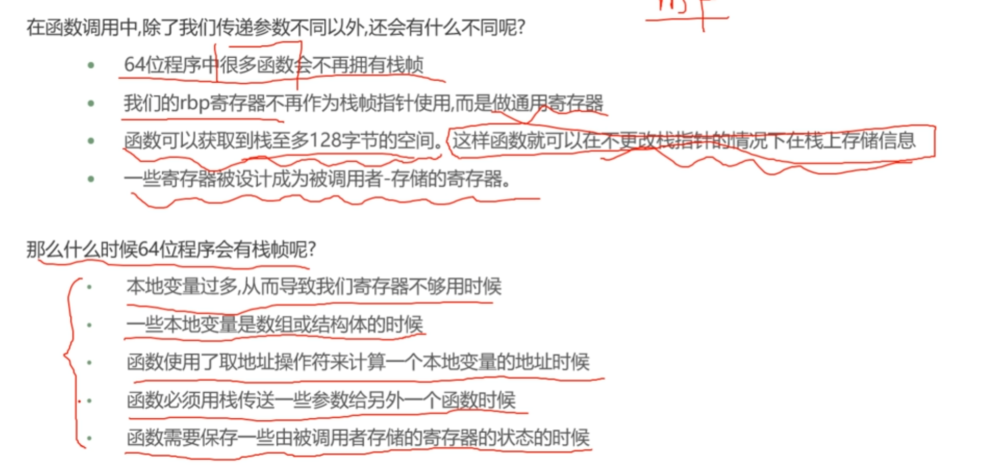

# 一、内存布局的不同

**不同：**

​	**1、64位布局和32位经典布局一样都是栈和内存映射区相对增长**

​	**2、堆区（heap）和 存放未初始化的全局变量和静态变量的区域（bss segment）是相连的**

​	**3、内存大小的变化**

# 二、 寄存器的不同

**rsp指针现在作为栈顶指针，而不是rbp，rbp现在用来进行数据存储，rip指令指针寄存器，用来存储程序执行下一条指令的地址**

# 三、参数传递的不同

# 四、函数调用的不同

