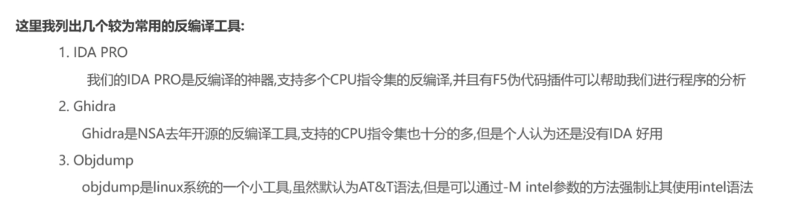
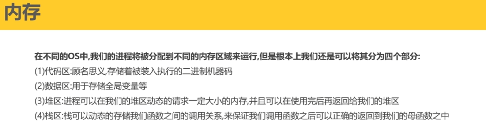
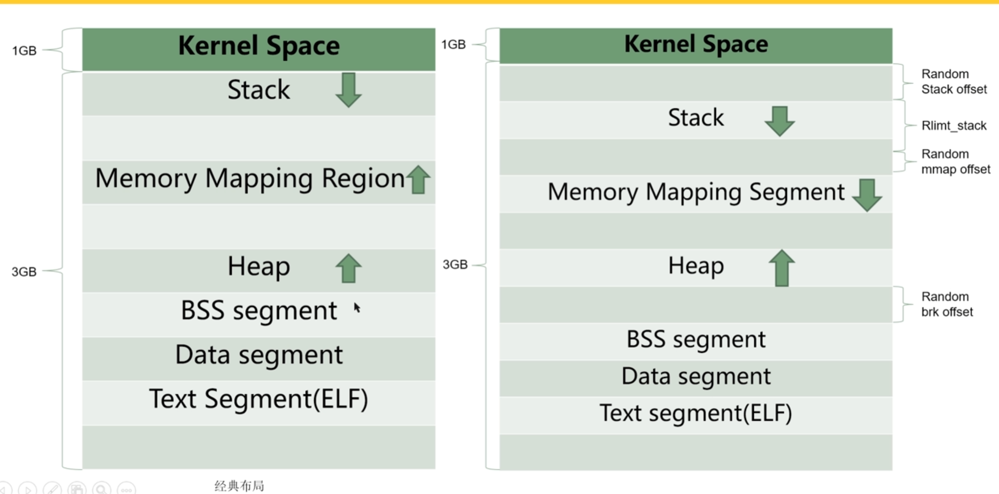
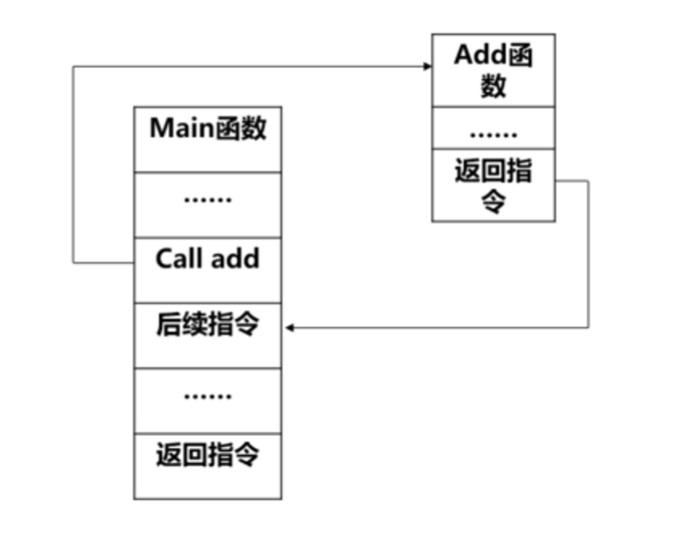
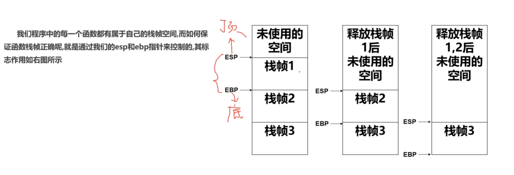
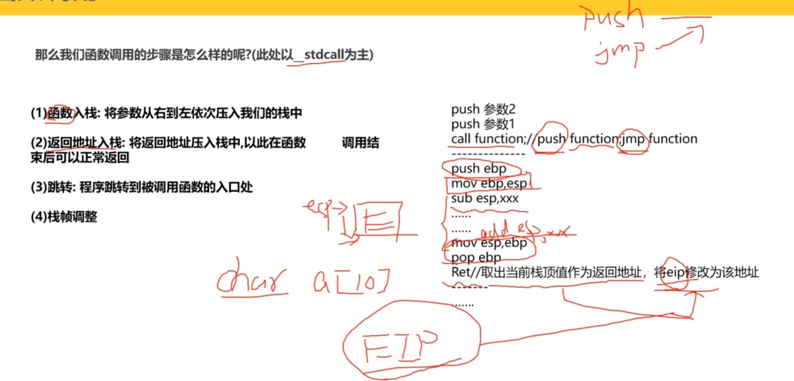

# 一. 编译与反编译

编译： 四个步骤（预编译 汇编 编译 链接）

反编译，将机器码反编译成汇编语言。

# 二、 工具介绍

常用的功能强大的工具：IDA PRO

objdump语法 ：objdump -M intel -d filename 显示Intel语法下的反汇编

# 三、内存

**32位内存布局**

​	经典布局已经被淘汰了，原因：

**其中内存映射区和栈相对增长，导致堆区内存极大可能溢出至内存映射区**

​	两者布局区别：

**经典布局中栈区和内存映射区相对增长，而现代布局是堆区和内存映射区相对增长**

# 四、 函数调用

**1、函数调用过程中系统运行**

**2、函数执行时的栈帧**

**3、函数调用约定**

**4、函数调用的步骤（以_stdcall调用约定）**

