# 内容目录

# 1、main_arena and no_main_arena

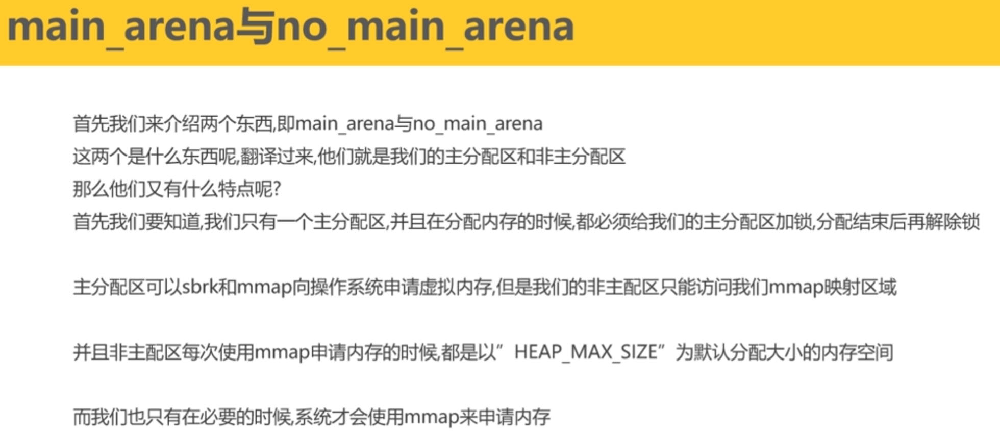

# 2、chunk的结构

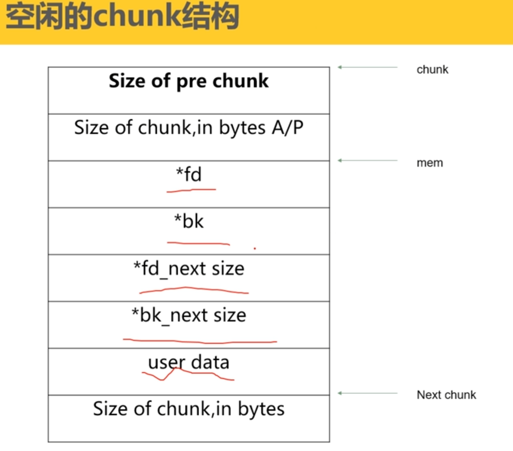

# 三、chunk的空间复用

# 四、空闲的chunk容器

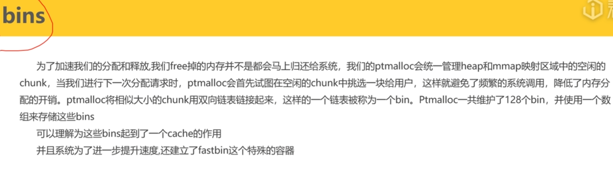

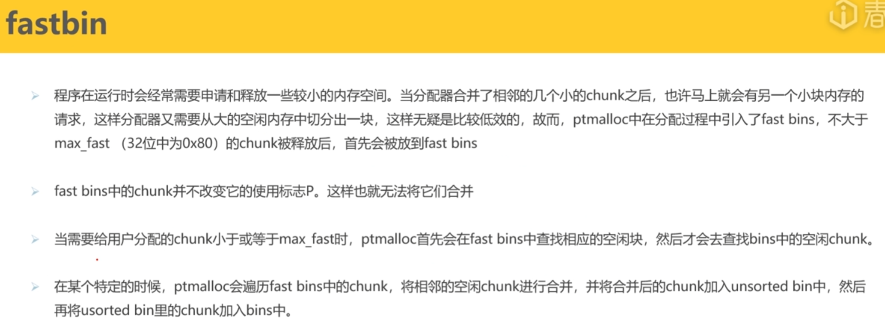

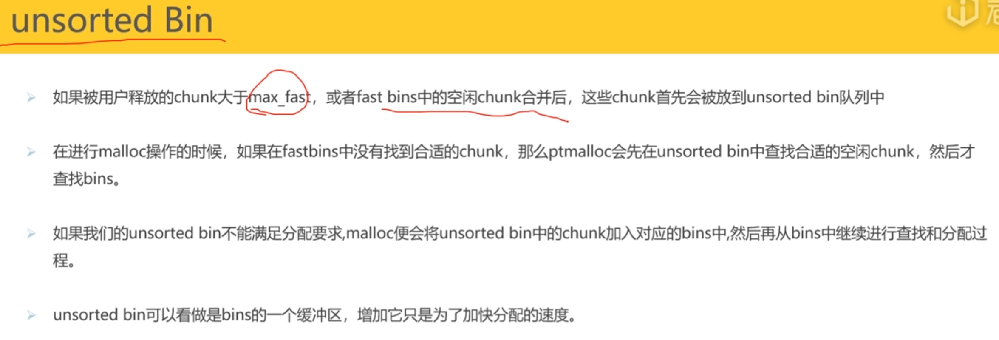

# 五、sbrk and mmap

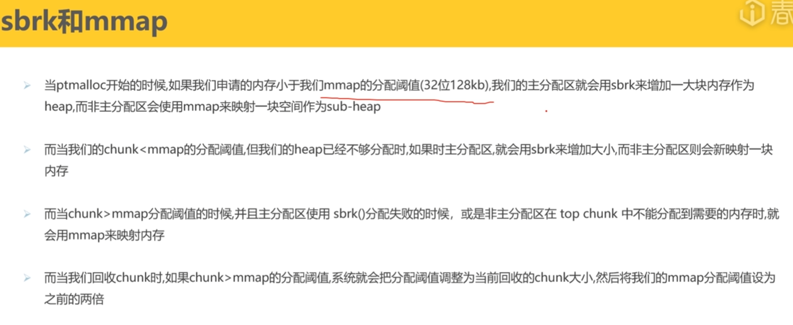

这张图片展示了 glibc 的内存分配器（ptmalloc）在不同场景下是如何向操作系统申请内存的。为了让你彻底理解这张图，我们需要深入剖析底层的两个系统调用：**`sbrk`** 和 **`mmap`**。

简单来说，`malloc` 只是一个管家，它并不产生内存。当管家手里的内存不够用时，它必须找操作系统进货。进货的方式主要有两种：

1. **`sbrk`**：相当于把自家的后院篱笆往外推，扩大领地。（扩大堆段）
2. **`mmap`**：相当于在外面临时租一个独立的仓库。（内存映射）

------

### 1. `sbrk` (Set Break)

这是最传统的堆内存增长方式。

- **原理**：

  在进程的虚拟地址空间中，有一个叫做 **Program Break（程序断点）** 的指针，它标记了**堆（Heap）** 的结束位置。

  - `sbrk(0)`：返回当前的 Break 位置。
  - `sbrk(x)`：将 Break 指针向上（高地址方向）移动 `x` 字节。移动后，新的空间就属于进程了。
  - `sbrk(-x)`：将 Break 指针向下收缩，将内存还给操作系统。

- **特点**：

  - **连续性**：增长出来的内存与之前的堆内存是**连续**的。
  - **速度快**：调整指针只需要极少的 CPU 指令，开销很小。
  - **局限性（最大的痛点）**：它是**“先进后出”**的线性结构。如果你申请了 A、B、C 三块内存，现在你想释放 B，你**无法**直接把 B 归还给操作系统，因为 C 还在上面压着。B 释放后只能变成“空洞”留在堆里，供进程下次 `malloc` 时复用，但物理内存可能仍被占用。

### 2. `mmap` (Memory Map)

`mmap` 本来是用来映射文件的（比如把文件映射到内存里读写），但在内存分配中，它通过**匿名映射（Anonymous Mapping）** 来申请纯粹的 RAM。

- **原理**：

  它不在传统的“堆（Heap）”区域操作，而是在**栈（Stack）和堆（Heap）中间的巨大空闲区域**（通常是动态链接库附近）找一块空地，独立开辟一段内存。

- **特点**：

  - **独立性**：申请的内存块是独立的，不与其他内存块连续。
  - **自由归还**：当你 `free` 这块内存时，通过 `munmap` 系统调用，这块内存会**立即、完全**地归还给操作系统。
  - **开销大**：`mmap` 需要内核查找空闲地址空间、建立页表映射等，由于涉及到页对齐（通常 4KB），对于小内存分配来说极其浪费且慢。

------

### 3. 为什么 ptmalloc 要结合使用两者？（解读你的图片）

你的图片中提到的 **128KB 阈值**（在 32 位系统上）正是为了平衡这两者的优缺点。

#### 情况 A：小内存申请 (< 128KB) -> 用 `sbrk`

**策略**：如果用户只要 10 字节，用 `mmap` 开辟一个 4KB 的页太浪费了，而且频繁系统调用太慢。

**操作**：主分配区（Main Arena）使用 `sbrk` 把堆顶往上推，切下一小块给你。

**后果**：这块内存释放后，通常**不会**立即还给操作系统，而是留在 glibc 的 bins（空闲链表）里，等待下一次 `malloc` 复用。这减少了系统调用次数，提升了性能。

#### 情况 B：大内存申请 (>= 128KB) -> 用 `mmap`

**策略**：如果用户要 1MB 内存，如果用 `sbrk` 分配，这 1MB 可能会把堆顶推得很高。如果这 1MB 夹在中间被释放了，由于高地址还有其他小对象存活，这 1MB 的巨大空洞就没法还给操作系统（产生严重的**内存碎片**）。

**操作**：直接用 `mmap` 找个独立的地方分配。

**后果**：当用户 `free` 这块大内存时，glibc 直接调用 `munmap`，内存瞬间归还给系统，降低进程的整体内存占用率。

#### 情况 C：非主分配区 (Non-main Arena) -> 用 `mmap`

**策略**：这是多线程环境下的优化。

**原因**：

- **主线程**（Main Arena）拥有传统的 Heap 段，可以使用 `sbrk`。
- **子线程**（Non-main Arena）如果都去抢同一个 `sbrk` 指针，锁的竞争会非常激烈。
- **解决**：子线程的“堆”其实全都是用 `mmap` 模拟出来的（图片里说的 `sub-heap`）。它们向系统申请一大块 `mmap` 空间，然后在这一大块里面再进行细粒度的切分。

------

### 4. 总结对比表

| **特性**       | **sbrk**                                    | **mmap**                                       |
| -------------- | ------------------------------------------- | ---------------------------------------------- |
| **内存位置**   | 紧接在数据段（BSS）之后，向高地址生长       | 在堆和栈之间的空闲区域随机分配                 |
| **连续性**     | 必须连续                                    | 独立块，不连续                                 |
| **归还给 OS**  | 困难（只有当堆顶是空闲时才能收缩）          | 容易（`free` 时直接 `munmap`）                 |
| **性能**       | 极快（简单的指针加减）                      | 较慢（复杂的内核操作、页表建立）               |
| **glibc 用途** | **小对象**（< 128KB），作为主要的 Heap 空间 | **大对象**，或者**多线程**中的子堆（Sub-heap） |
| **Chunk 标志** | `IS_MMAPPED` 位为 0                         | `IS_MMAPPED` 位为 1                            |

# 六、内存分配的具体步骤

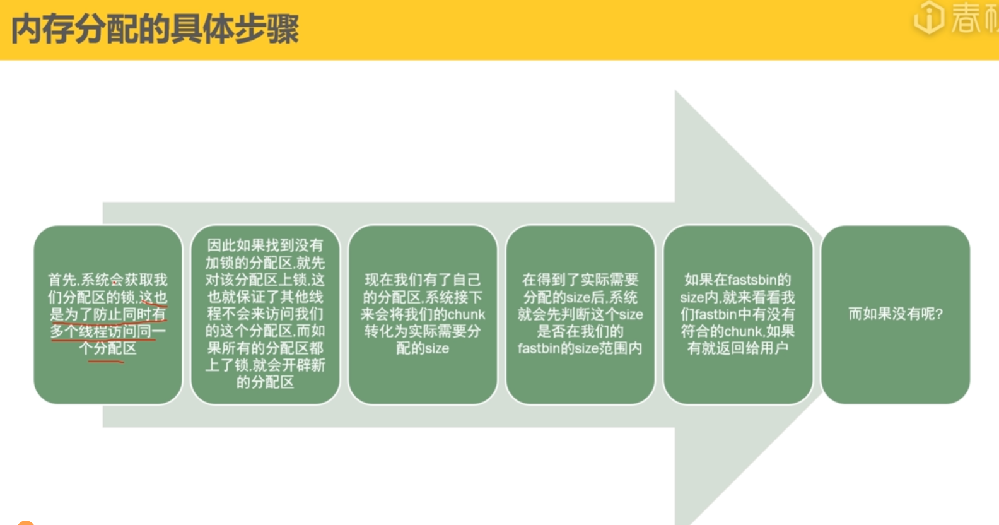

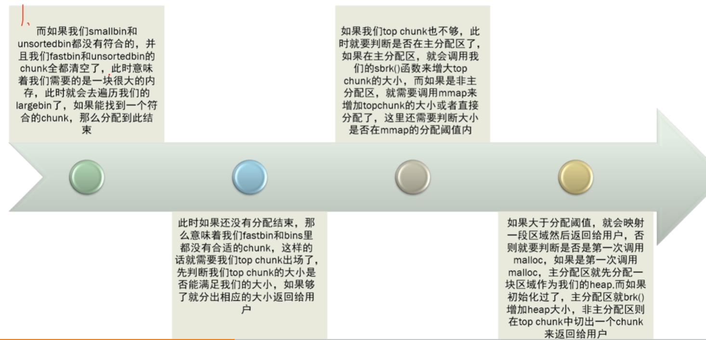

# 七、内存回收的步骤

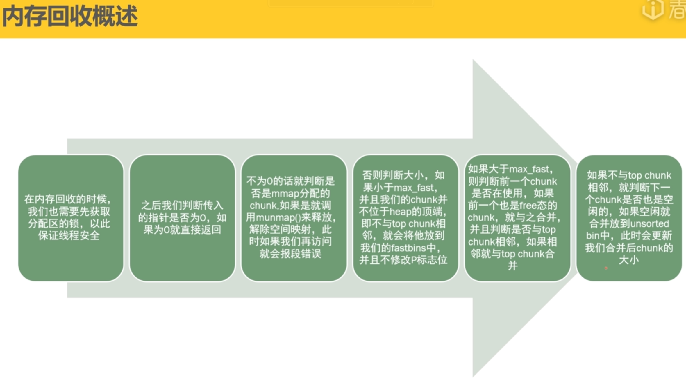

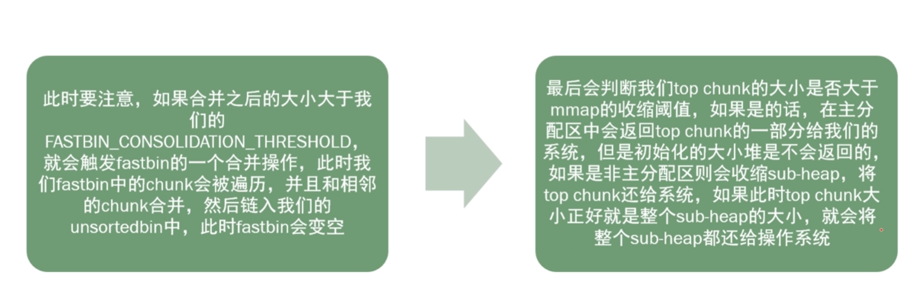

# 八、一些零碎的知识

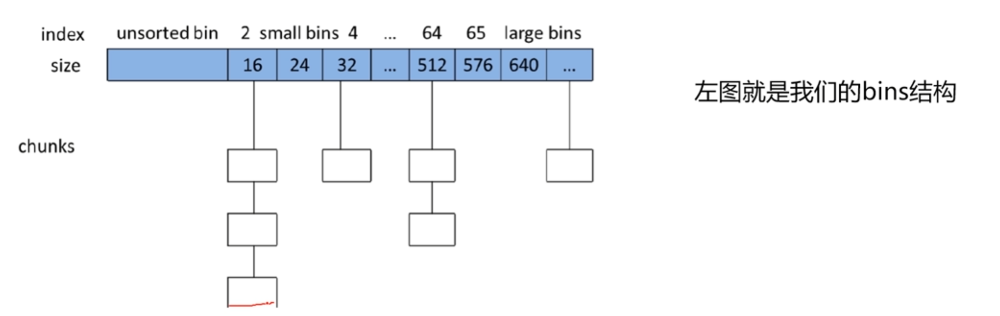

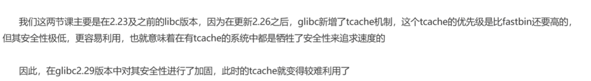