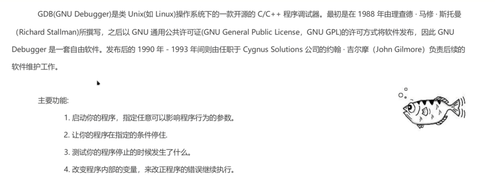
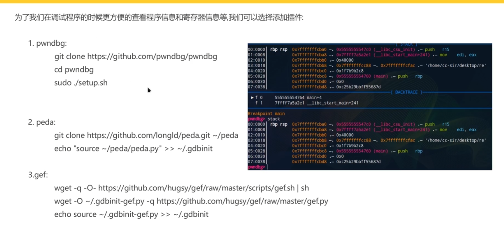
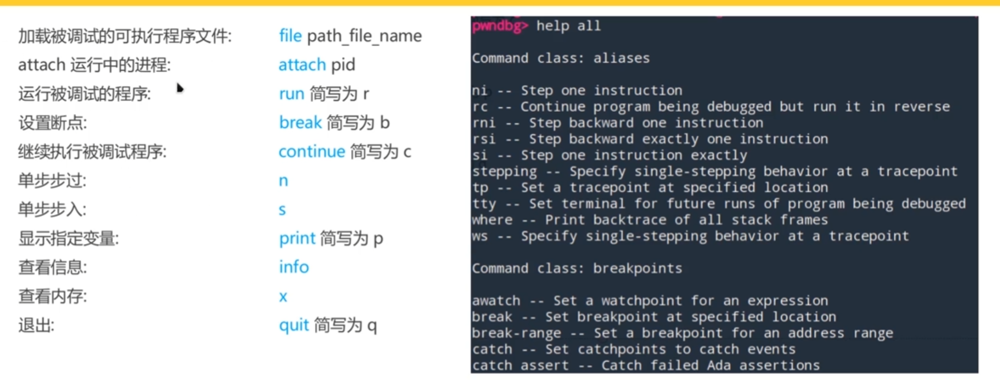
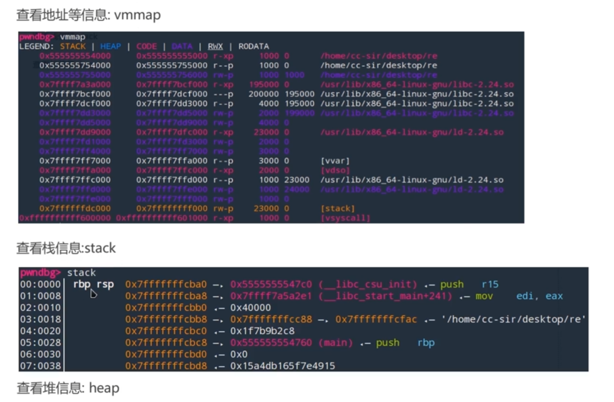

# 一、gdb的介绍

# 二、gdb的使用

​								**其他指令可以使用help all指令来看其他指令说明**

**x指令使用 x/(number)wx address    (w显示四位字节，number表示生成多少个，g显示八位字节)**

**b指令下断点可以对函数名下断点也可以对地址下断点，但对地址下断点的指令格式不同**

* **b main(对函数名下断点)   /   b *address（对地址下断点）**

**info b 可以查看设置了什么断点**

**d number 删除断点，其中number可以使用info b 来查看他的标号**

**修改寄存器的值： set $rax(寄存器名)=0x666(你想修改的数值)**

**修改地址的值：set $地址=数值**	**注意set只能一次修改4个字节的值**

## 插件功能

**查看堆还可以使用bins指令**