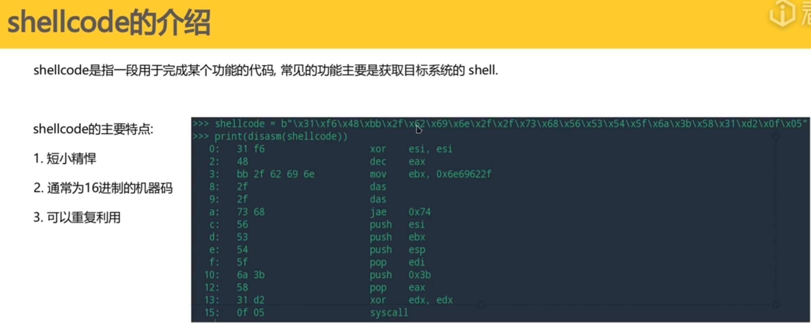
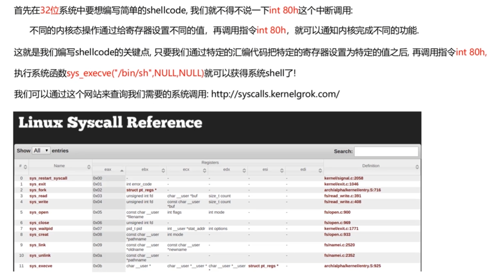
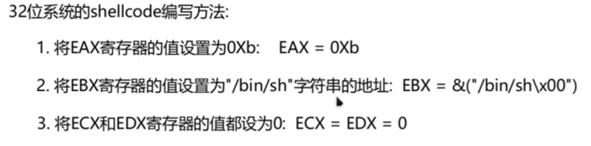
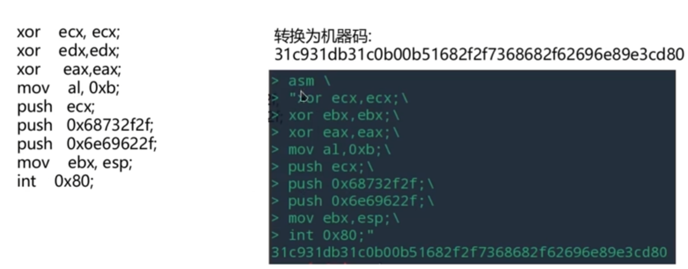
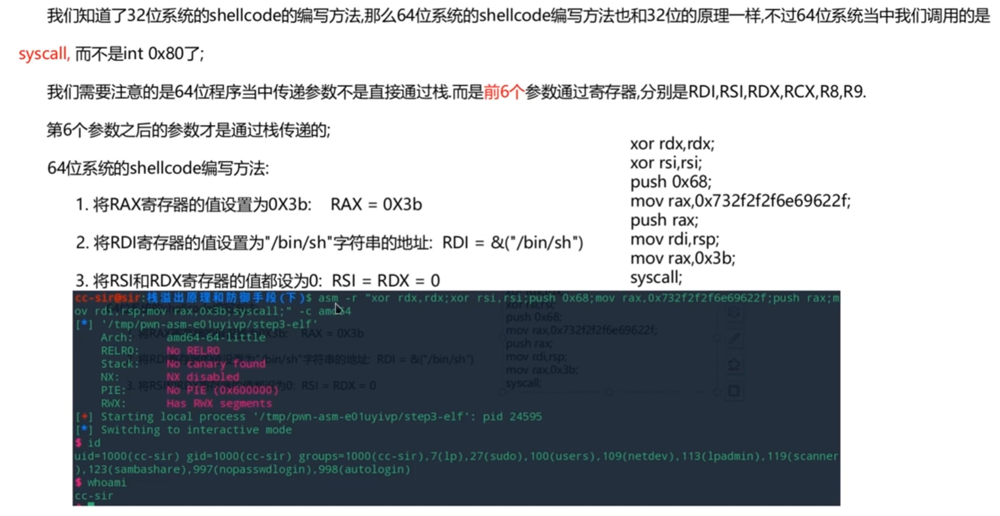
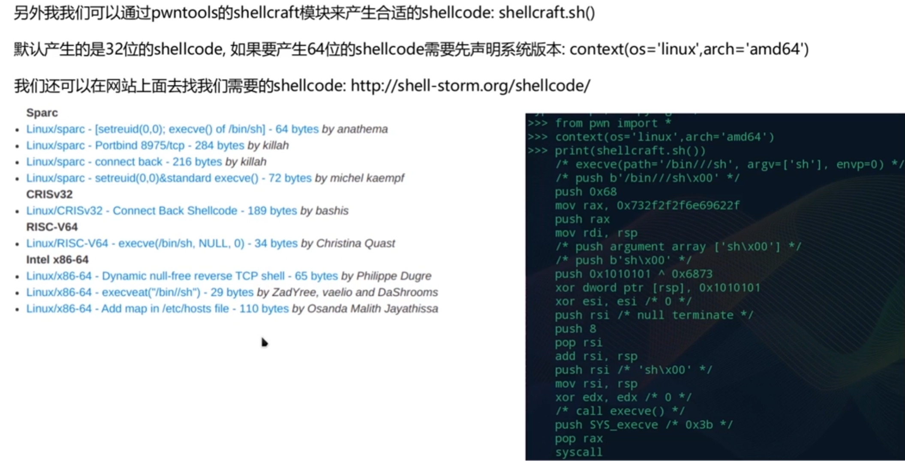
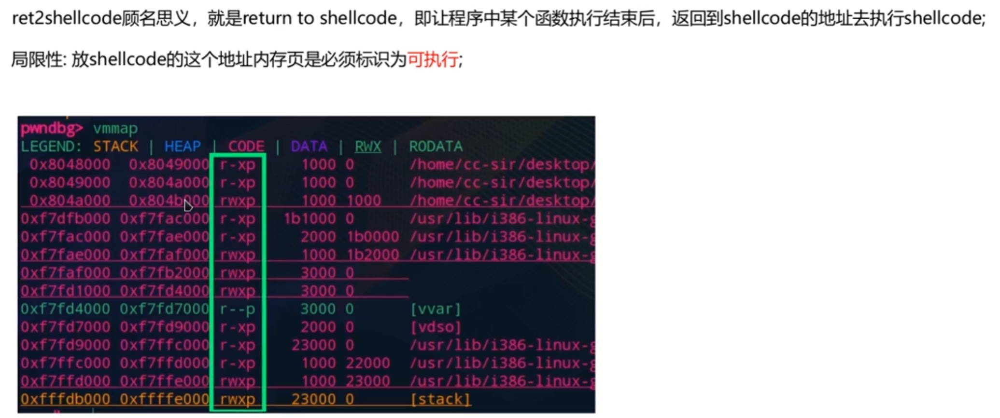

## 一、shellcode的介绍

## 二、shellcode的编写

### 32位系统shellcode编写

### 64位系统shellcode编写

### pwntools内模块编写shellcode（默认生成32位）

## 三、shellcode的利用（ret2shellcode攻击方法）

**即NX防御关闭，内存中存在可读可写的段**

**rwx为可读可写可执行**

