# 一、编译与链接

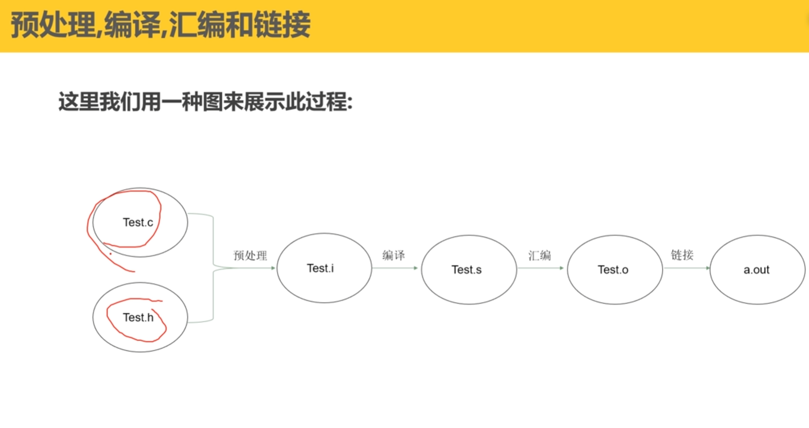

**1、预处理**

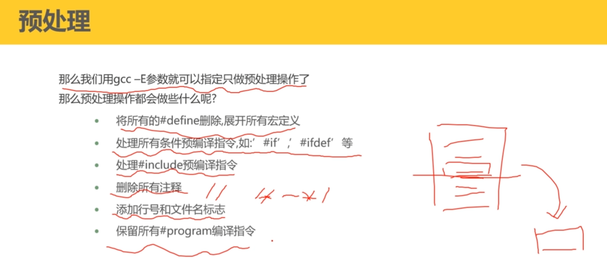

​	**删除注释的时候，如果一行都是注释，删除注释后不会并行**

**2、编译**

**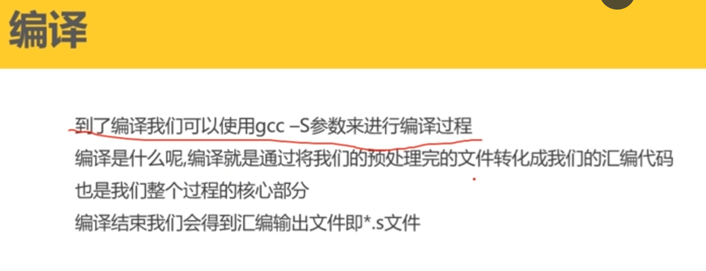**

**3、汇编**

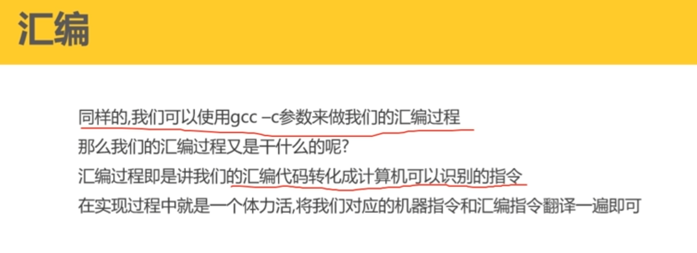

**4、链接**

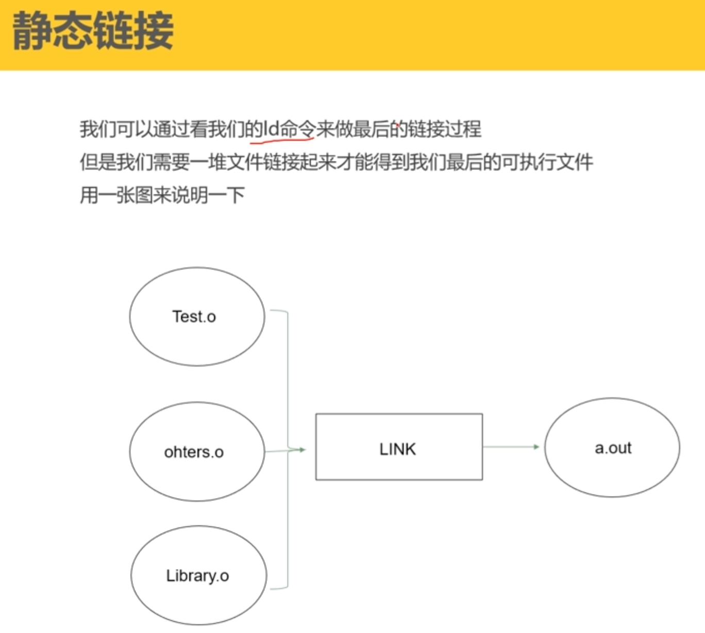

 # 二、装载

**页映射**

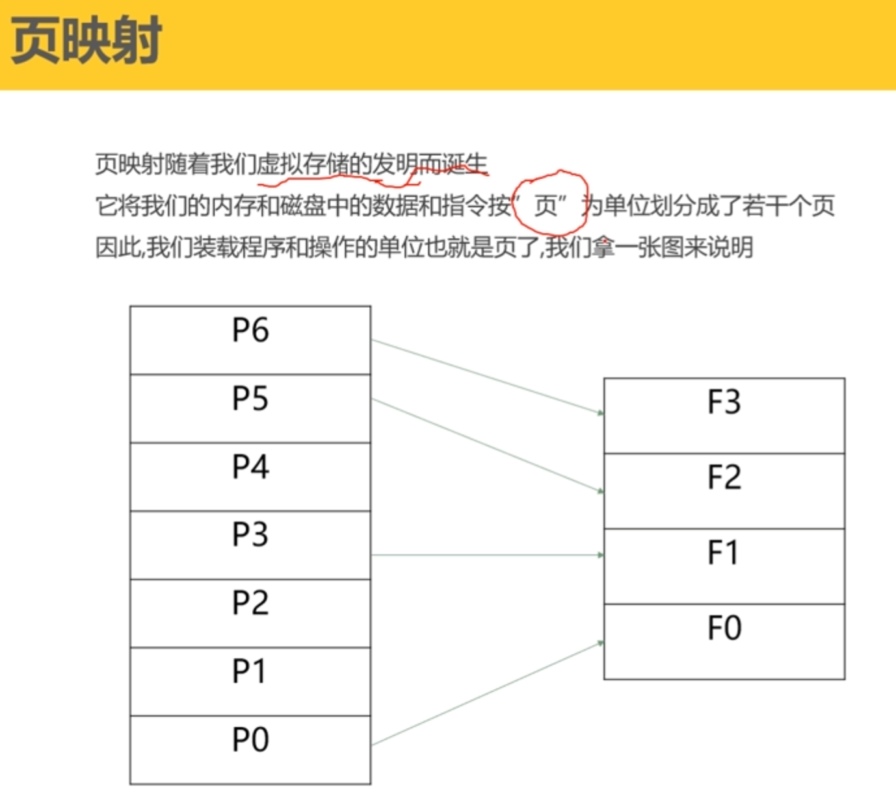

# 三、地址无关代码

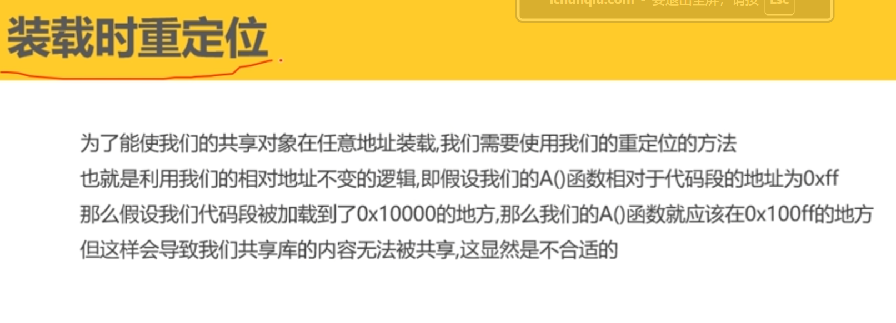

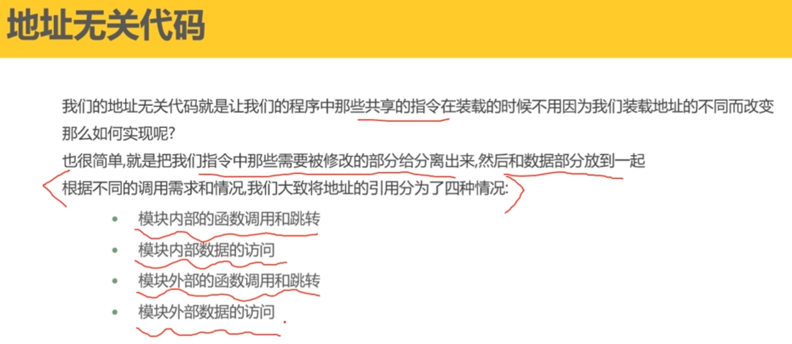

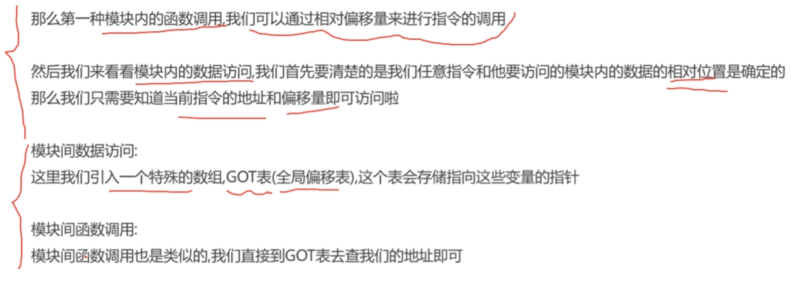

**1、模块内数据和指令的访问：相对偏移量和指令的地址**

**2、模块外的数据和函数调用：使用GOT表(全局偏移表）**

# 四、动态链接

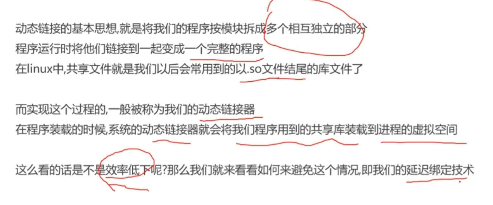

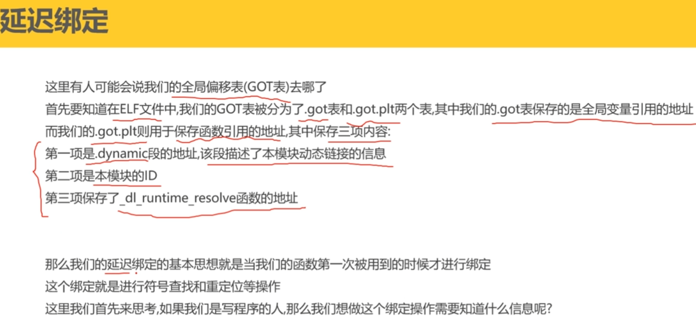

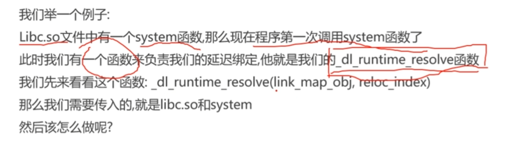

