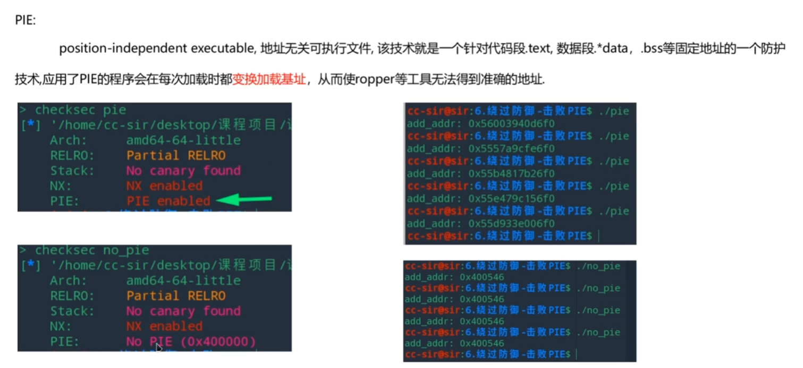
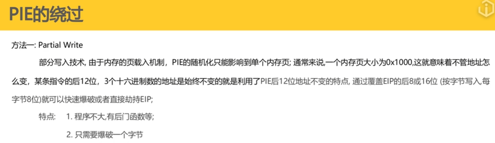
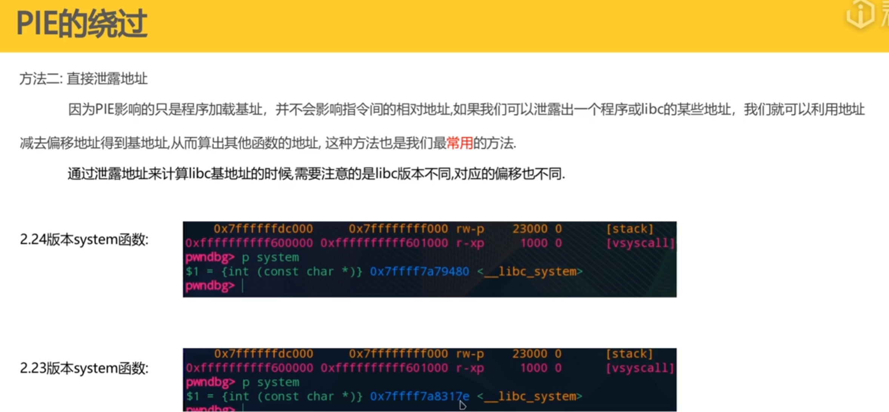

# PIE的介绍



# PIE的绕过

## 一、prtial write（部分写入技术）



## 二、栈中泄露地址



# 总结


# 做题问题

### 1. 核心概念：什么是“对齐” (Alignment)？

想象你有一把无限长的直尺（内存），操作系统（OS）要在上面放积木（程序）。

操作系统有个强迫症：**它不能把积木随便乱放，必须对齐到“刻度线”上。** 这个刻度线的间距，就是**“页大小 (Page Size)”**。

- **标准情况**：刻度间距是 **4KB** (4096 字节)。
- **你的情况**：刻度间距可能是 **64KB** (65536 字节)。

这有什么区别？区别在于**“随机化能随机到多细的程度”**。

------

### 2. 数学演示：十六进制的魔法

在十六进制（Hex）中，每一位代表 4 bit。

- **4KB** = $4096$ = $16^3$ = **`0x1000`**
- **64KB** = $65536$ = $16^4$ = **`0x10000`**

注意到了吗？**4KB 只有 3 个零，而 64KB 有 4 个零！**

这就决定了基地址（Base Address）的尾巴长什么样。

#### 情况 A：标准 4KB 对齐 (Standard Linux)

ASLR（随机化）生成的基地址必须是 `0x1000` 的倍数。这意味着基地址的**最后 3 位**必须是 0。

- **随机基址**：`0x...A123` **`4`** `000` (注意：倒数第 4 位 `4` 是随机生成的)
- **固定偏移**：`+` `0x...0000` **`0`** `900` (这是 `frontdoor` 函数的偏移)
- **最终地址**：`0x...A123` **`4`** `900`

**结果**：倒数第 4 位是 `4 + 0 = 4`。因为基址的那一位是随机的，所以最终地址的那一位也是**随机的**。

#### 情况 B：你的环境 (64KB 对齐)

如果系统强制 64KB 对齐，基地址必须是 `0x10000` 的倍数。这意味着基地址的**最后 4 位**都必须是 0。

- **随机基址**：`0x...A123` **`0`** `0000` (注意：倒数第 4 位**被强制归零了**！)
- **固定偏移**：`+` `0x...0000` **`0`** `0900`
- **最终地址**：`0x...A123` **`0`** `0900`

**结果**：

1. 基址的倒数第 4 位**必须是 0**（为了对齐）。
2. 偏移量的倒数第 4 位**是 0**（因为 `0x900` 小于 `0x1000`）。
3. **0 + 0 = 0**。

这就是为什么在你的环境下，倒数第 4 位永远是 `0`，而不会变成 `1, 2, ... F`。

------

### 3. 为什么你的环境会是 64KB 对齐？

这通常不是标准的 Ubuntu/Debian 行为（它们默认是 4KB），但以下情况会让它变成 64KB：

1. **ARM 架构 (关键点)**：如果你是在 **Apple Silicon (M1/M2/M3)** 的 Mac 上运行虚拟机（VMware Fusion, Parallels, Docker），或者你是用的树莓派。ARM64 架构非常喜欢用 64KB 的页大小来提升性能。
2. **WSL2 (Windows Subsystem for Linux)**：某些版本的 WSL2 内核配置为了兼容性或性能，可能调整了内存布局粒度。
3. **特定的内核配置**：如果你用的是某些“硬化”过的安全内核或者是嵌入式系统的内核，它们可能修改了 `CONFIG_ARM64_64K_PAGES` 或类似选项。

### 总结

- **4KB 对齐**：基址 = `.......X000` (X 是随机的)。加上 `0x900` -> 结果是 `.......X900`。**X 会变。**
- **64KB 对齐**：基址 = `.......0000` (倒数第4位强制为0)。加上 `0x900` -> 结果是 `.......0900`。**0 不会变。**

因为你的环境“刻度”比较粗（64KB），导致原本应该随机的那一位，被迫变成了固定的 `0`。这就是你为什么只要把 `\x39` 改成 `\x09` 就能 100% 成功的原因！

#### 1. 对于 `partial_write` (2MB 对齐)

当加载器看到 `Align: 0x200000` 时，它会强迫程序的基地址必须是 2MB 的倍数。

- 2MB = $2^{21}$。这意味着地址的 **低 21 位 (Bit 0 - Bit 20)** 都完全取决于文件内的偏移，不受 ASLR 随机化的影响（或者说随机化发生在更高位）。
- **21 bits** 换算成十六进制：$21 \div 4 = 5.25$。
- 也就是说，**地址的最后 5 个十六进制数字（以及第6个数字的一部分）都是固定的！**
- 所以你的 `partial_write` 哪怕第 4 位、第 5 位看起来都像是“死”的（比如总是 0），这是因为文件偏移量本来就很小，而基址这部分被迫对齐为了 0。

#### 2. 对于 `./pie` (4KB 对齐)

你手里的这个 `./pie` 程序应该是用普通默认配置（或者为了教学演示）编译的，对齐大小是标准的 **4KB** (`0x1000`)。

- 4KB = $2^{12}$。这意味着只有 **低 12 位** 是固定的。
- **12 bits** 换算成十六进制：$12 \div 4 = 3$。
- 所以，**只有最后 3 个数字（169）是固定的**。第 4 个数字（d, 1, 9）属于 ASLR 的随机范围，所以它一直在变。

#### 1. 对于 `partial_write` (2MB 对齐)

当加载器看到 `Align: 0x200000` 时，它会强迫程序的基地址必须是 2MB 的倍数。

- 2MB = $2^{21}$。这意味着地址的 **低 21 位 (Bit 0 - Bit 20)** 都完全取决于文件内的偏移，不受 ASLR 随机化的影响（或者说随机化发生在更高位）。
- **21 bits** 换算成十六进制：$21 \div 4 = 5.25$。
- 也就是说，**地址的最后 5 个十六进制数字（以及第6个数字的一部分）都是固定的！**
- 所以你的 `partial_write` 哪怕第 4 位、第 5 位看起来都像是“死”的（比如总是 0），这是因为文件偏移量本来就很小，而基址这部分被迫对齐为了 0。

#### 2. 对于 `./pie` (4KB 对齐)

你手里的这个 `./pie` 程序应该是用普通默认配置（或者为了教学演示）编译的，对齐大小是标准的 **4KB** (`0x1000`)。

- 4KB = $2^{12}$。这意味着只有 **低 12 位** 是固定的。
- **12 bits** 换算成十六进制：$12 \div 4 = 3$。
- 所以，**只有最后 3 个数字（169）是固定的**。第 4 个数字（d, 1, 9）属于 ASLR 的随机范围，所以它一直在变。

你的 `readelf` 输出完美验证了我们刚才的推论！这就是“教科书级”的证据。

请看这一行（以及其他 `LOAD` 段）：

Plaintext

```
  Type           Offset             VirtAddr           ...  Align
  LOAD           ...                ...                ...  0x1000
```

这里的 **`Align 0x1000`** 就是关键所在。

### 深度解读：为什么这个文件“乱动”得更厉害？

#### 1. 对齐粒度只有 4KB (`0x1000`)

- **数学含义**：`0x1000` = $4096 = 2^{12}$。
- **系统行为**：操作系统在加载这个程序时，只保证基地址的**低 12 位**（3 个十六进制数）是 0。
- **结果**：
  - **低 3 位 (0-11 bit)**：完全固定，等于文件偏移。
  - **第 4 位 (12-15 bit)**：属于 ASLR 的随机范围，操作系统可以随意设置。

这就是为什么你在运行 `./pie` 时，地址看起来是这样的（假设偏移是 `0x169`）：

- `0x...`**`d`**`169`

- `0x...`**`1`**`169`

- `0x...`**`9`**`169`

  (最后 3 位 `169` 没变，但倒数第 4 位 `d`, `1`, `9` 一直在变)

#### 2. 对比你的 `partial_write`

回顾一下之前那个 `partial_write` 的情况，它的 `Align` 是 **`0x200000` (2MB)**。

- **数学含义**：$2MB = 2^{21}$。
- **结果**：低 21 位都是固定的。这意味着低 **5 个半**十六进制数都是固定的。
- 这就是为什么那个程序倒数第 4 位死活不随机的原因——编译器把它“钉死”了。

### 总结：如何一眼判断是否需要爆破？

下次拿到题目，先运行 `readelf -l ./binary | grep Align`：

| **Align 值**       | **十六进制位数** | **攻击策略 (Partial Overwrite)**        |
| ------------------ | ---------------- | --------------------------------------- |
| **0x1000 (4KB)**   | 后 **3** 位固定  | **覆盖 2 字节时，必须爆破 (1/16 概率)** |
| **0x200000 (2MB)** | 后 **5** 位固定  | **覆盖 2 字节时，无需爆破 (100% 成功)** |

# 使用readelf -l profilename 来查看程序使用多大的页对齐

