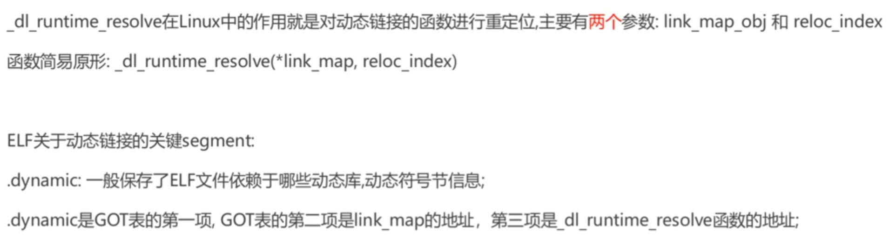
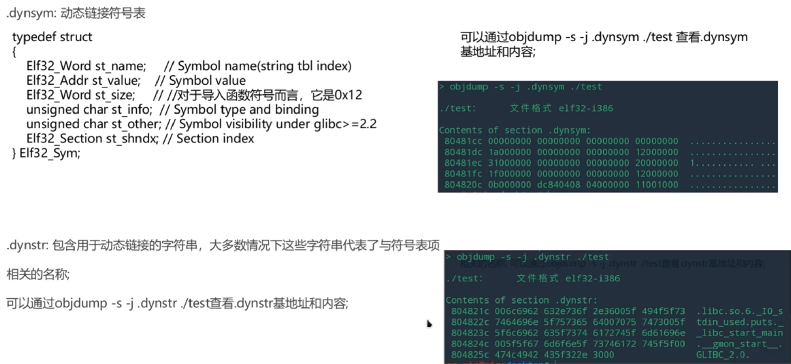
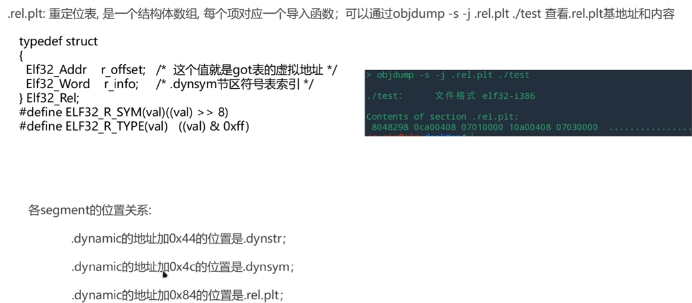
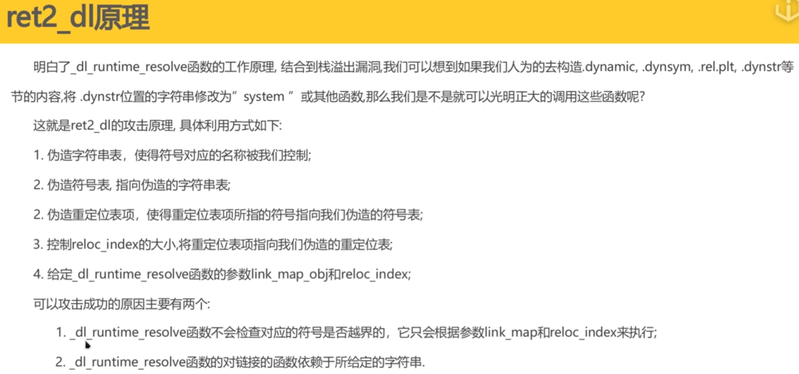
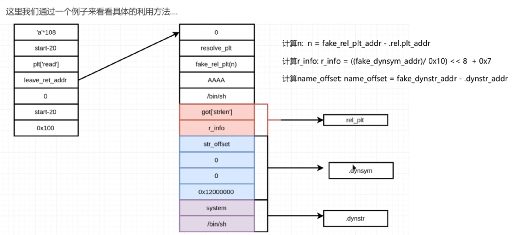

# ret2_dl介绍

# dl_runtime_resolve介绍

这是一个非常关键的问题！你问到的“第二个参数”，在 `_dl_runtime_resolve` 的函数定义中，通常指的是 **`link_map` 指针**。

在 32 位系统中，栈的布局是这样的：

1. `reloc_arg` (由 `puts@plt` 压入) -> **你要找谁？**
2. `link_map` (由 `PLT[0]` 压入) -> **你在哪找？（去哪个库找？）**
3. `_dl_runtime_resolve` 被调用

你已经知道了 `reloc_arg` 是为了确定“是哪个函数”，那么 `link_map` 就是为了确定 **“去哪里找这些表”**。

------

### 一、 `link_map` 是什么？（身份 ID 卡）

`link_map` 是一个结构体指针，它是 Linux 动态链接器（ld.so）用来描述 **“当前加载的一个模块”** 的身份信息的。

每一个被加载进内存的程序（如 `./pwn`）和动态库（如 `libc.so`），在内存里都有一个属于自己的 `link_map` 结构体。这些结构体通过双向链表连在一起。

**用大白话解释：**

如果 `reloc_arg` 是你要找的人的 **“工号”**，那么 `link_map` 就是这个公司的 **“地图”和“基址”**。

链接器收到工号后，会问：“我去哪个公司的花名册查？是主程序的？还是 libc 的？”

`link_map` 就会告诉它：“就查 **当前这个主程序** 的花名册。”

------

### 二、 它具体有什么用？（提供基址和表位置）

你刚才问到的那几张表（`.dynsym`, `.dynstr`, `.rel.plt`），它们的地址**不是**写死在 `_dl_runtime_resolve` 代码里的，而是**存放在 `link_map` 里的**。

`_dl_runtime_resolve` 拿到 `link_map` 后，会做以下数学题：

#### 1. 确定“基准地址”（Base Address）

程序开启了 PIE 或者动态库加载时，加载地址是随机的。`link_map` 里有一个字段 `l_addr`，记录了**这个程序实际加载到了内存的哪个位置**。

#### 2. 定位“三张表”的绝对地址

`link_map` 里有一个数组 `l_info`，里面存了动态段（`.dynamic`）的各种指针。

链接器要找字符串表 `.dynstr` 时，它是这么算的：

$$\text{STRTAB\_ADDR} = \text{link\_map}\to\text{l\_info}[\text{DT\_STRTAB}] \to \text{d\_un.d\_ptr}$$

(注：在某些版本中还需要加上 `l_addr` 基址)

**总结：**

- **`reloc_arg`** 提供了 **偏移量**（Row Index）。
- **`link_map`** 提供了 **表格的基地址**（Table Base Address）。

只有把两者结合：**`表基址 + 偏移量`**，才能真正找到数据。

------

### 三、 为什么这在 Pwn 中很重要？（Fake Link_map 攻击）

这涉及到了 `Ret2dlresolve` 的进阶玩法。

通常的 `Ret2dlresolve` 攻击，我们只伪造 `reloc_arg`，让链接器去查原本的 `.dynstr` 表里我们伪造的数据。

**但是，如果我想让链接器去我完全控制的一块内存里查表呢？**

这时候黑客就会**伪造 `link_map`**！

1. **攻击思路**：我们在栈上不仅伪造 `reloc_arg`，还把传给 `_dl_runtime_resolve` 的第二个参数（`link_map` 指针）也覆盖掉，让它指向我们在堆栈上伪造的一个假的 `link_map` 结构体。
2. **欺骗后果**：
   - 链接器拿到假的 `link_map`。
   - 它去读 `l_info[DT_STRTAB]`，结果读到了我们填写的假地址。
   - 链接器就会跑去我们指定的任意内存地址去找字符串表。
   - 这样我们就不受原有 `.dynstr` 表位置的限制了（这在 64 位下特别有用，因为 64 位对地址范围有要求）。

### 四、 总结

- **参数 1 (`reloc_arg`)**：**索引**。告诉链接器“我要查第几号”。
- **参数 2 (`link_map`)**：**上下文**。告诉链接器“请用这个结构体里记录的地址作为基准（Base），去定位 `.dynsym` 和 `.dynstr` 表在哪里”。

如果没有 `link_map`，链接器就像拿到了一个抽屉编号（reloc_arg），但不知道该去哪个房间（link_map）的柜子里找。

理解这四个概念，就像理解 **“如何通过一串数字编号，最终在茫茫人海中找到一个叫张三的人”** 的全过程。

在 Linux 的 ELF 文件（可执行文件）中，所有的数据都是为了**节省空间**和**提高查找效率**而分开存放的。这四个东西就像是一环扣一环的 **“藏宝图线索”**。

我们还是用 **“查户口”** 的比喻来解释，这四个东西分别对应了四个步骤：

------

### 全景图：线索链条

整个过程是一个**链式查找**：

1. **`reloc_arg`** (入场券) → 指向 **`.rel.plt`** (任务单)
2. **`.rel.plt`** (提供符号编号) → 指向 **`.dynsym`** (档案卡)
3. **`.dynsym`** (提供名字偏移) → 指向 **`.dynstr`** (名字列表)
4. **`.dynstr`** (拿到 "puts") → **去 libc 找函数**

------

### 1. `reloc_arg`（入场券 / 索引号）

- **是什么？** 它不是一张表，而是一个 **数字**（通常是偏移量或索引）。它是 `_dl_runtime_resolve` 函数收到的第一个参数。
- **有什么用？** 它告诉链接器：“你要处理 **`.rel.plt` 表中的第几号任务**”。
- **形象比喻：** 你去办事大厅办事，取号机给你的一张 **排队小票**，上面写着 `0x8`（表示你要去处理第 2 个任务）。链接器拿到这个号，才知道要去表格的哪一行看数据。

------

### 2. `.rel.plt`（重定位表 / 任务清单）

- **是什么？** 这是一个 **表格**，里面每一行记录了一个需要被“修复”的函数信息。每一行是一个结构体（`Elf32_Rel` 或 `Elf64_Rela`）。

- **里面存了什么？** 主要存了两个关键数据：

  1. **`r_offset`**：**回填地址**。修好后的真实地址要写到哪里去？（也就是 GOT 表的某个位置）。
  2. **`r_info`**：**符号信息**。这里面藏着一个重要的**编号**（Symbol Index），告诉链接器去查哪个人的档案。

- **形象比喻：** 这是办事大厅的 **“任务登记簿”**。 链接器拿着刚才的“排队小票”找到对应的一行，上面写着：

  > “任务：请去查 **7号档案（Symbol Index）** 的人，查到住址后，填入 **0x804a018（GOT表地址）** 这个格子里。”

------

### 3. `.dynsym`（动态符号表 / 档案柜）

- **是什么？** 这也是一个 **表格**，存的是**符号（函数或变量）的详细属性**。每一行是一个结构体（`Elf32_Sym`）。

- **里面存了什么？** 它记录了函数的很多属性（大小、类型等），但最重要的字段是：

  - **`st_name`**：**名字索引**。它**不直接存名字**（因为名字长短不一，不好对齐），而是存一个数字，表示名字在字符串表中的偏移量。

- **形象比喻：** 这是警局的 **“人员档案柜”**。 链接器根据刚才任务单里的“7号”打开第7个抽屉，拿出一张卡片。 卡片上**没有写名字**，而是写着：

  > “这个人的名字太长了写不下，请去隔壁 **‘名字墙’（.dynstr）** 的 **第 100 个字节（st_name）** 处查看。”

------

### 4. `.dynstr`（动态字符串表 / 名字墙）

- **是什么？** 这根本不是表，而是一大坨 **紧挨着的字符串**。它就是把程序里用到的所有名字（`printf`, `puts`, `system`, `lib.so`...）全部拼在一起，中间用 `\0` 隔开。

- **里面存了什么？** 类似这样：`...read\0__gmon_start__\0stdin\0puts\0system\0...`

- **形象比喻：** 这是一面密密麻麻的 **“名字墙”**。 链接器拿着刚才档案卡上的“100”，拿把尺子量到第 100 个字节的地方，终于看到了几个字母：

  > **"p-u-t-s"**

------

### 总结：一次完整的“跑腿”

当程序执行 `puts` 并触发 `_dl_runtime_resolve(link_map, reloc_arg)` 时，链接器的内心独白是这样的：

1. **看 `reloc_arg`**：哦，我要处理 **偏移量为 0x8** 的那个重定位任务。
2. **查 `.rel.plt`**：找到 0x8 那一行。
   - *指令*：修好后填到 GOT 表的 `0x804a018`。
   - *线索*：这个函数的身份在 `.dynsym` 表的 **第 4 号** 索引。
3. **查 `.dynsym`**：找到第 4 号档案。
   - *线索*：这个函数的名字在 `.dynstr` 表的 **偏移量 0x20** 处。
4. **查 `.dynstr`**：跑到 0x20 处一看。
   - *结果*：发现了字符串 **"puts"**！
5. **最终搜索**：好了，我知道你要找 "puts" 了。我去 `libc.so` 里把 `puts` 的真实地址找出来，填到 GOT 表去！

------

### 💡 为什么 Ret2dlresolve 能攻击？

理解了这个链条，你就明白黑客在做什么了：

**黑客的思路：** “链接器你是根据这些表来找名字的对吧？如果我把这些表里的数据给**篡改**了呢？”

1. 我在栈上伪造一个奇怪的 `reloc_arg`。
2. 让这个 `reloc_arg` 指向我在内存里**伪造的一个 `.rel.plt` 表项**。
3. 让这个伪造的表项，指向我**伪造的一个 `.dynsym` 表项**。
4. 让这个伪造的档案，指向我**写入的一段字符串 "system"**（而不是原来的 "puts"）。
5. **结果**：链接器傻乎乎地跑完整个流程，最后大喊：“长官，我查到了，你要找的名字是 **system**！这就带你去！”

这就是**伪造护照，骗过安检**。

# ret2_dl原理

# ret2_dl实践

