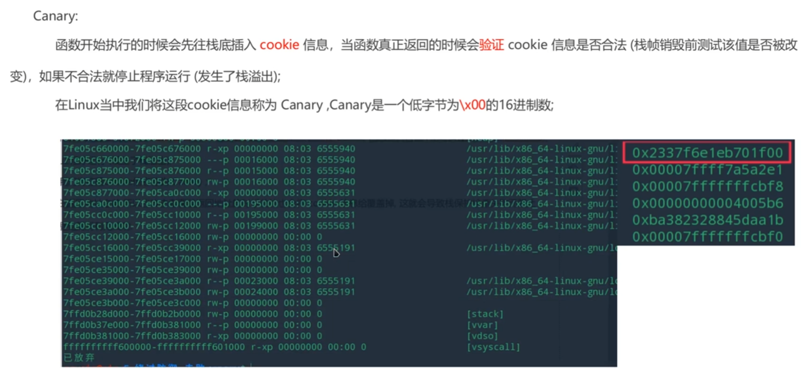
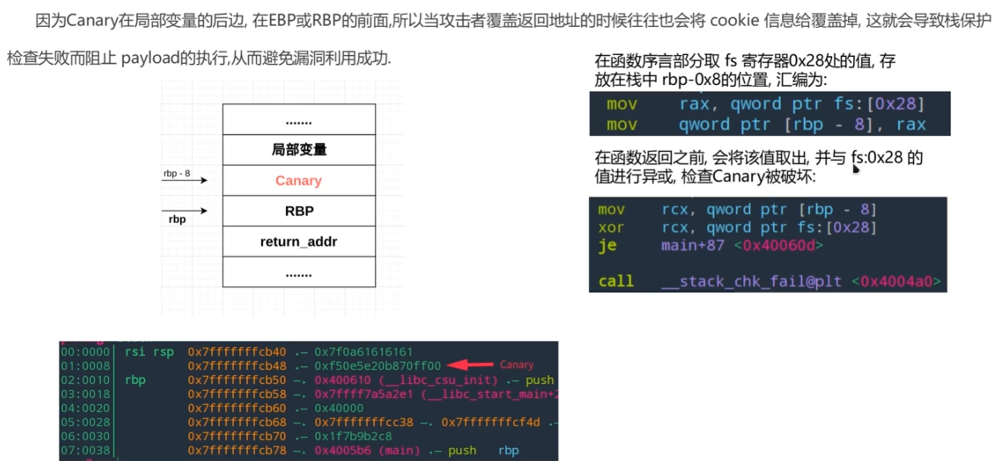
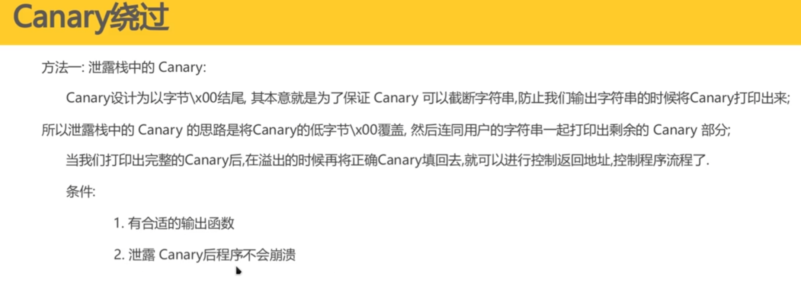
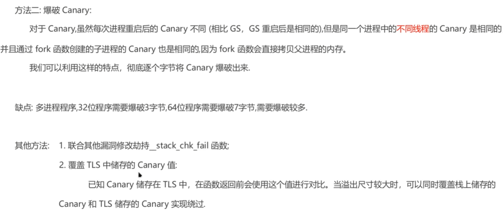

# canary介绍



# canary原理



**64位程序中canary位于ebp-12位置，32位程序中位于ebp-8字节**

# canary绕过






## 做题时的错误

这是一个非常经典且直觉上容易弄错的概念。你的困惑在于认为 `recv` 是跟在 `send` 后面发生的，所以它应该只接收“发送之后产生的回应”。

**但事实并非如此。**

在计算机网络和进程通信（Pipe）中，接收缓冲区（Receive Buffer）是一个 **先进先出（FIFO）的队列**。

请记住这句话：**`send` 操作完全不会影响接收缓冲区里已有的数据。**

我用一个**管道模型**来为你演示为什么你的逻辑会失效：

### 1. 核心概念：管道（Pipe）与队列

想象在你（Python脚本）和程序（pwn2）之间有一根管子。

- 程序往管子里塞数据（Output）。
- 你从管子这头取数据（Input）。
- **管子里的数据如果没被取走，它会一直堵在门口。**

### 2. 你的脚本执行的时间轴 (错误发生的瞬间)

让我们一毫秒一毫秒地看发生了什么：

#### T0: 程序启动 (`p = process('./pwn2')`)

- **程序动作**：`pwn2` 启动，执行 `puts("Welcome!")`。

- **管道状态**：程序把 "Welcome\n" 塞进了管道。

- **你的缓冲区**：

  Plaintext

  ```
  [ "Welcome\n" ]  <-- 等待被读取
  ```

#### T1: 你的循环开始，发送 Payload (`p.send(payload)`)

- **你的动作**：你向程序的输入端发送了 payload。

- **关键点**：你只是往程序的嘴里塞了东西，但**并没有去清理程序吐在管道里的旧东西**。

- **你的缓冲区（没变！）**：

  Plaintext

  ```
  [ "Welcome\n" ]  <-- 依然堵在门口！
  ```

#### T2: 程序处理 Payload (服务端行为)

- **程序动作**：`pwn2` 读入你的 payload，检查 Canary。

  - **情况 A (猜对了)**：程序再次打印 "recv sucess" 和下一轮的 "Welcome"。
  - **情况 B (猜错崩了)**：程序什么都不打印直接挂掉。

- **假设猜对了，你的缓冲区变成了这样**：

  Plaintext

  ```
  [ "Welcome\n", "recv sucess\n", "Welcome\n" ]
  ^ 旧的           ^ 新的回应
  ```

#### T3: 你调用接收 (`a = p.recvuntil("welcome\n")`)

- **你的动作**：脚本去管道口拿数据，规则是“拿到 'welcome\n' 为止”。

- **发生的事情**：脚本伸手一抓，**立刻抓到了排在最前面的那个旧的 "Welcome\n"**。

- **变量 `a` 的内容**：`"Welcome\n"`。

- **管道里剩下的内容**：

  Plaintext

  ```
  [ "recv sucess\n", "Welcome\n" ]
  ```

### 3. 逻辑崩塌点 (`if b"recv" in a`)

- 你拿到的 `a` 是 **T0时刻** 产生的那个旧欢迎语。
- 旧欢迎语里当然没有 `"recv"` 这个词。
- **结论**：脚本判断 `False`。
- **后果**：即使你发对了 payload，缓冲区里也有成功的消息，但因为你**读取错位**了，你只读到了旧垃圾，导致你以为自己失败了。

### 总结图解

Plaintext

```
错误的逻辑 (你的想象):
send()  ----> 清空之前的接收缓冲区 (X 错误！)
recv()  ----> 只接收 send 之后产生的数据 (X 错误！)

真实的逻辑 (操作系统):
Buffer: [ Old_Welcome ]
send()  ----> 数据发出，Buffer 保持不变: [ Old_Welcome ]
Server  ----> 产生新数据 New_Success
Buffer: [ Old_Welcome, New_Success ]
recv()  ----> 它是排队的！先读到 Old_Welcome
```

### 怎么修？

这就是为什么 `exp2.py` 在 `send` 之前加了一句 `p.recvuntil("welcome\n")`。 这就好比在开始做事之前，先**把信箱里的旧信件清空**，确保下次伸手进去拿到的，一定是针对你最新请求的回信。


### 其他问题

**1. 类型不匹配 (Python 3 `bytes` vs `str`)**

- **你的代码**：`canary = '\x00'` (字符串) 和 `b"a"*100` (字节串) 以及 `chr(j)` (字符串) 混合相加。
- **后果**：在 Python 3 中，`bytes` 和 `str` 不能直接拼接，会报 `TypeError`。
- **修正**：全部统一使用字节流。`canary = b'\x00'`，使用 `p8(j)` 代替 `chr(j)`。

**2. 逻辑缩进错误**

- **你的代码**：`payload1 = ...` 这一行以及后面的发送接收逻辑看起来和 `for j` 循环头是对齐的（或者缩进混乱）。
- **后果**：Python 依靠缩进来判断代码块。如果缩进不对，循环体可能无法正确执行。

**3. 交互时序问题 (Sync Issue)**

- **你的代码**：直接 `p.send` 然后 `p.recvuntil("welcome")`。
- **后果**：
  - 首先，程序刚启动时通常会发一个 `welcome`。你的脚本没有把这个初始的 `welcome` 读掉，导致第一次 `recvuntil` 读到的是开头的那个，而不是你发送 payload 后的响应。
  - 其次，**IO 阻塞风险**：`read` 函数通常在收到换行符 `\n` 或缓冲区满时才返回。如果你发送的数据（100多字节）没填满缓冲区且没发换行符，服务端可能会一直等待输入，导致脚本卡死（Hanging）。

**4. 循环逻辑**

- **你的代码**：`for i in range(3)`。
- **修正**：Linux 的 Canary 第一个字节固定是 `\x00`，且通常在低位（小端序）。你只需要爆破剩下的 3 个字节，这个循环次数是对的。