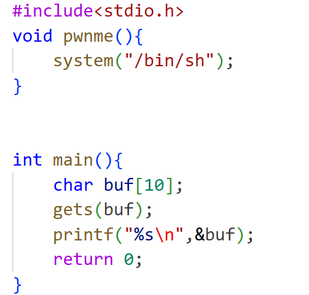
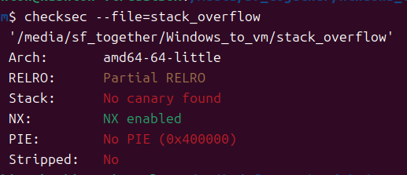

# 一、源码

# 二、分析

## **1、注意到源程序使用gets函数来对buf数组进行输入，而gets函数对输入的数据长度没有限制**

## **2、原程序的保护机制是:**

**其中栈保护和PIE都是关闭的，为什么需要关闭这两个防御机制我们才可以使用ret2text攻击：**

### 1. 为什么要关闭栈保护 (Stack Protector / Canary)?

**你的攻击方式：** 你发送了一串长长的 `aaaaaaaa...`，企图从 `buf` 一路覆盖到 `Return Address`。

**栈保护的工作原理：** 编译器会在**局部变量（Buffer）**和**返回地址（Return Address）**之间插入一个随机生成的数值，这个值被称为 **Canary（金丝雀）**。

- **正常流程：** 函数结束前，程序会检查这个 Canary 的值是否被修改。
- **攻击流程：** 当你的 `aaaaa...` 数据流向返回地址蔓延时，它必须先经过 Canary。因此，Canary 会被你的 `a` 覆盖掉。
- **结果：** 程序检测到 Canary 变了，判定发生了溢出攻击，立即执行 `__stack_chk_fail` 并终止程序，根本不会给 CPU 跳转到 `Return Address` 的机会。

**形象图解：**

**为什么必须关闭？** 因为目前的初级阶段，你**不知道**那个随机的 Canary 值是多少，无法在 Payload 中伪造出正确的 Canary。关闭它 (`-fno-stack-protector`) 就是为了移除这块绊脚石，允许你随意覆盖栈上的数据。

------

### 2. 为什么要关闭 PIE (Position Independent Executable)?

**你的攻击方式：** 你在脚本里写死了 `pwnme` 的地址，比如 `0x400586`。或者通过 `elf.symbols['pwnme']` 获取了一个静态地址。

**PIE 的工作原理：** PIE 使得程序代码段的加载地址在每次运行时都是**随机**的。

- **关闭 PIE (No-PIE)：** 程序的代码段总是加载到固定的虚拟地址（例如 `0x400000` 开始）。`pwnme` 永远都在 `0x400586`。
- **开启 PIE：** 程序每次运行，代码段的基地址（Base Address）都会变（例如第一次在 `0x5555...`，第二次在 `0x7777...`）。`pwnme` 的真实地址变成了 `基地址 + 偏移量`。

**结果：** 如果你开启了 PIE，你脚本里硬编码的 `0x400586` 在运行时指向的是一片无效的内存或者是其他乱七八糟的东西。当你把返回地址覆盖成 `0x400586` 时，CPU 跳转过去就会发生**段错误 (Segmentation Fault)**。

**形象图解：**

**为什么必须关闭？** 为了让 `pwnme` 函数的地址固定下来，这样你才能在 Python 脚本里提前写好它。如果开启 PIE，你需要先利用漏洞泄露程序的基地址（Info Leak），算出偏移量，才能构建 Payload，这属于进阶技巧。

## 3、buf数组当溢出时向高地址方向覆盖，然后覆盖到ret的返回地址时用pwnme函数地址覆盖掉返回地址这样就会执行system系统调用

# 三、实现

### 一、最初课程视频复现

**1. 按照视频跟做**

1. gdb stack_overflow
2. b main
3. r
4. cyclic 生成 50 个 字符并复制
5. n单步步过至gets函数将cyclic字符黏贴至输入
6. n单步步过至ret指令得到返回地址的的八位字节（视频中为4位字节后问ai4位字节是默认的但也有特殊，我的机器指令需要八位）
7. 使用cyclic -l 0x< address >得到偏移量
8. 编写exp
9. 执行python3 exp.py

**结果：程序返回EOF中断，这是为什么呢**

## 2.询问ai，发现问题：因为64 位环境下的系统函数需要进行内存对齐

要理解对齐要求，我们需要从**硬件架构**、**操作系统标准**和**具体的崩溃指令**三个层面来讲。

------

### 1. 底层原因：CPU 的“大胃口” (SIMD 指令集)

在早期的 CPU（比如 32 位奔腾时代），数据通常是一块一块（4 字节或 8 字节）搬运的，这时候对齐要求并不严格。

但是，现代 CPU 为了追求极致速度，引入了 **SIMD（单指令多数据流）** 技术，比如 **SSE** 和 **AVX** 指令集。

- 这些指令使用特制的**超大寄存器**（XMM 寄存器），宽度为 **128 位（16 字节）**。
- 也就是说，CPU 可以一次性吞吐 16 字节的数据。

**硬件限制：** 为了保证读写速度，硬件设计者规定：**当使用这些 128 位指令读写内存时，内存地址必须是 128 位（16 字节）对齐的。**

- 就像火车进站，车门必须完美对准站台门。如果错开了一半（比如错开 8 字节），为了保护电路或简化逻辑，CPU 会直接报错。

### 2. 直接凶手：`movaps` 指令

你在 Ubuntu 18.04+ 系统中遇到的崩溃，罪魁祸首通常是 glibc 库中 `system()` 或 `printf()` 函数内部的一条特定指令：

> **`movaps`** (Move **Aligned** Packed Single-precision floating-point)

请注意中间那个 **A** (Aligned)。

- 这条指令的作用是将内存中的数据搬运到 XMM 寄存器中。
- **它的死规定**：操作的内存地址（通常是栈上的某个地址）必须以 **0** 结尾（十六进制），即 **16 的倍数**。

如果你传递给它的栈地址是以 **8** 结尾的（比如 `0x7fffffffe008`），CPU 就会触发 **#GP (General Protection Fault)**，操作系统捕获后报出 **SIGSEGV**。

### 3. 操作系统法律：System V AMD64 ABI

为了让不同编译器写的程序能互相调用（比如你的 C 程序调用 Linux 的 glibc 库），大家必须遵守一套共同的“交通规则”，这就是 **ABI (Application Binary Interface)**。

Linux 下的 **System V AMD64 ABI** 明确规定：

> **The stack pointer (`rsp`) must be 16-byte aligned immediately before the `call` instruction is executed.** (在执行 `call` 指令之前，`rsp` 必须是 16 字节对齐的。)

让我们看看这个过程中的数学变化：

1. **调用前 (`call` 之前)**：ABI 规定 RSP 必须是对齐的（例如 `0x...00`）。
2. **执行 `call`**：`call` 指令会将 **8 字节** 的返回地址压入栈顶。
3. **进入函数 (`call` 之后)**：由于压入了 8 字节，此时 RSP 变成了 `0x...F8`（**不再对齐，差 8 字节**）。

**结论**：当程序刚刚进入一个函数的第一行代码时，**栈天然就是“不对齐”的（RSP 结尾是 8）。**

### 4. 为什么漏洞利用时会崩溃？

现在我们来看为什么你的 Payload 会导致崩溃。

#### 正常程序的流程（编译器帮你处理好了）

编译器知道“刚进函数时 RSP 结尾是 8”。所以，它生成的 `pwnme` 代码，或者 `system` 函数内部的代码，会通过 `push rbp` (8字节) 或者 `sub rsp, 8` 来调整栈，凑齐 16 字节，然后再去执行 `movaps`。

#### 你的攻击流程（破坏了平衡）

当你进行栈溢出攻击时，你是直接修改了返回地址，**强行跳转**到 `pwnme` 的。

1. **Main 函数结束**：执行 `ret`。`pop rip` 导致 RSP **+8**。
2. **跳转到 Pwnme**：此时你没有经过正常的 `call` 指令（没有压入返回地址）。
3. **状态错位**：
   - 正常情况下，进入 `pwnme` 时，栈应该“**不对齐**”（结尾是 8）。
   - 但因为你通过 `ret` 跳过来（多弹了一次），导致进入 `pwnme` 时，栈竟然是“**对齐**”的（结尾是 0）。
4. **System 函数懵了**：
   - `pwnme` 内部调用 `system()`。
   - `system` 内部假定：“进来的很多时候是 8 结尾，我自己处理一下就能变成 0 结尾，然后就能用 `movaps` 了”。
   - 结果你给它一个 0 结尾的，它按照既定逻辑处理完，反而变成了 8 结尾。
   - **执行 `movaps` -> 崩溃。**

## 三、解决方法：添加ret指令来调整栈内存

### 深度解析：为什么必须加 `ret`？

你可能会问：“我的偏移量 18 是对的，地址也是对的，为什么要多此一举加一个 `ret`？”

这涉及到 64 位 Linux (Glibc) 的一个**强制规则**：

#### The "MOVAPS" Issue (MOVAPS 问题)

在现代 Linux 系统中，`system()` 函数（以及很多其他库函数）内部会使用 SSE 指令集来进行优化，其中最著名的指令是 `movaps`。

- **规则**：`movaps` 指令要求当前的栈顶指针（RSP）必须是 **16 字节对齐**的（也就是说，RSP 的地址必须以 `0` 结尾，比如 `0x...700`）。
- **你的脚本**：当你直接溢出并劫持返回地址时，你破坏了原本正常的函数调用栈，导致进入 `pwnme` -> `system` 时，RSP 的地址**不是** 16 的倍数（通常是以 `8` 结尾，比如 `0x...708`）。
- **后果**：CPU 执行到 `movaps` 时检测到地址未对齐，直接抛出 `General Protection Fault` 异常，程序崩溃（SIGSEGV），导致连接断开（EOF）。

#### `ret` 指令的神奇作用

我们在 Payload 中插入一个 `ret` 指令的地址（Ret2Ret 攻击）：

1. 程序 `main` 函数结束，执行 `ret`。
2. **第一跳**：跳到了我们插入的那个 `ret` 指令上。
   - `ret` 指令的动作是：`pop rip`。这意味着它会从栈上弹出一个值，导致 **RSP 增加了 8 字节**。
3. **第二跳**：因为刚刚那个 `ret` 弹出的值正好是紧接着的 `pwnme` 地址，所以程序接着跳到了 `pwnme`。
4. **关键点**：虽然最终还是到了 `pwnme`，但因为中间多了一次 `pop` 操作，**RSP 发生了变化（+8）**。
   - 如果之前 RSP 结尾是 `8`（不对齐），加 8 之后结尾变成了 `0`（对齐了！）。
5. **结局**：进入 `system()` 时，栈完美对齐，Shell 成功弹出。

## 四、注意：有时候加ret反而错误：

在 64 位栈溢出利用中，栈对齐就像一个**开关**。因为 `ret` 指令会让栈指针 `rsp` 增加 8 字节，所以它起到的作用就是**翻转**对齐状态。

### 1. 核心逻辑：+8 与 16 的关系

- **对齐要求**：`system()` 内部的 SSE 指令要求 `rsp` 的地址结尾必须是 `0`（即 16 的倍数，如 `0x...700`）。
- **不对齐**：如果 `rsp` 的地址结尾是 `8`（如 `0x...708`），就会崩溃。
- **`ret` 的作用**：执行一次 `ret`，`rsp` 就会 `+8`。

这就像按开关灯一样：

- 如果当前是 **“灭 (Misaligned)”** 的，你加一个 `ret`，它就 **“亮 (Aligned)”** 了（这是我们上一条讨论的情况）。
- 但如果当前本来就是 **“亮 (Aligned)”** 的，你多手加了一个 `ret`，它就变成 **“灭 (Misaligned)”** 了，程序反而会崩溃。

### 2. 为什么通常默认是“不对齐”的？（为什么通常需要加 `ret`？）

在 Ret2Text（直接跳转到函数）攻击中，绝大多数情况下我们都需要加那个 `ret`。原因在于**我们“跳过”了正常的函数调用过程**。

请看下面的对比图：

**正常调用 `pwnme` 时：**

1. 主程序执行 `call pwnme`。
2. **`call` 指令会自动把“返回地址”压入栈**（栈深度 +8）。
3. 进入 `pwnme`，再调用 `system`，此时栈刚好凑齐 16 字节对齐。

**溢出攻击跳转 `pwnme` 时：**

1. 主程序执行 `ret`（我们覆盖了返回地址）。
2. CPU 直接跳到了 `pwnme` 的第一行代码。
3. **注意：我们要么是跳过了 `call` 指令，所以栈上少压了一个 8 字节的返回地址。**
4. 这导致进入 `system` 时，栈刚好差了 8 字节，处于“不对齐”状态。
5. **补救**：我们手动在 payload 里加一个 `ret`，强行把 `rsp` 抬高 8 字节，模拟了对齐。

### 3. 什么情况下“本来就是对齐的”？（即不需要加 `ret`）

虽然少见，但以下情况你不需要（也不能）加 `ret`：

1. **你跳过的不是函数开头**：如果你没有跳到 `pwnme` 的第一行（`0x400586`），而是跳到了 `pwnme` 里面的某一行代码（比如 `pwnme+1` 或 `pwnme+4`），恰好绕过了一些 `push rbp` 之类的栈操作指令，导致栈刚好对齐了。
2. **特殊的编译器优化**：某些编译器版本生成的 `main` 函数在 `return` 之前，栈的状态可能比较特殊（比如为了某些局部变量做了填充），导致 `ret` 之后 `rsp` 刚好停留在“不对齐”的位置，这样你跳过去反而负负得正了。
3. **不同的 Libc 版本**：并非所有版本的 `system()` 都会触发 `movaps` 崩溃。有些旧版或特定编译版的 libc 容忍度较高。

### 4. 终极测试策略

在 CTF 比赛或实战中，没有人会每次都拿纸笔去算这一步是不是差 8 字节。大家的做法非常简单粗暴，被称为 **"The Toggle Strategy"（开关策略）**：

> **先试 Payload A（不带 ret）：** `padding + address_of_function`
>
> **如果崩溃（EOF/Segfault），就试 Payload B（带 ret）：** `padding + address_of_ret + address_of_function`

**总结：** 既然你之前不加 `ret` 崩溃了，说明你的环境属于“默认不对齐”。 但如果你的环境变了，或者你攻击的目标函数变了，确实可能出现“加了 `ret` 反而挂了”的情况。**记住，`ret` 只是一个用来调节 `+8` 字节偏移的砝码。**

###  那个 `ret` 指令到底修复了什么？

我们在 payload 里加一个 `ret`，其实是进行了一次人工干预。

| **步骤** | **动作**              | **RSP 变化** | **当前 RSP 尾数 (假设初始为0)** | **对齐状态** |
| -------- | --------------------- | ------------ | ------------------------------- | ------------ |
| 1        | Main 函数 `ret`       | +8           | 8                               | 不对齐       |
| 2        | **你的 Gadget `ret`** | **+8**       | **0** (16进位)                  | **对齐**     |
| 3        | 进入 `pwnme`          | 无           | 0                               | 对齐         |
| 4        | `pwnme` 内部逻辑      | ...          | ...                             | **错位了**   |

**等等！** 这里有个反直觉的地方。

其实，加了 `ret` 之后，我们是想让进入 `system` 那个时刻的栈满足要求。

通常情况是：

- **不加 `ret`**：进入 `system` 时，栈是 **Misaligned** -> `movaps` 炸。

- **加了 `ret`**：我们把栈顶指针向高处挪了 8 字节。这相当于把“奇数”变成了“偶数”。

- 这就好像你把整个栈结构往上提了一格。进入 `system` 内部执行到 `movaps` 那个瞬间，地址刚好被修正为 16 的倍数。

  ### 总结

  1. **硬件原因**：SSE 寄存器（128位）读写内存要求地址必须是 16 的倍数。
  2. **触发指令**：`movaps` 是一条如果不满足对齐就直接自杀的指令。
  3. **根本原因**：你的攻击跳过了正常的 `call` 指令，导致栈指针比程序预期的位置少（或多）了 8 字节。
  4. **解决方法**：加一个 `ret` 指令，消耗掉 8 字节的栈空间，人工把“错位”给对回去。

### 查找ret的地址可以看当执行至ret时rip指针的值，以上ret2ret操作都是对64位程序考虑，而32位程序通常不需要严格的16位对齐

**ret指令是拿栈顶指针指向的栈块，指令并不在栈帧上而指令需要的数据在栈帧上**

